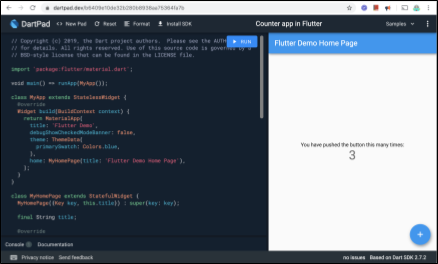
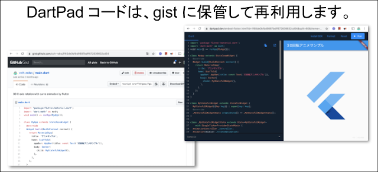

### DartPad について

#### DartPad は、公式の Dart / Flutter オンライン実行環境

- メリット（手軽）  
  - 誰でも使えます。(アカウント登録不要)  
  - Dart プログラムを編集＆実行できます。  
  - Flutter for Web アプリを編集＆実行できます。  
  - Webブラウザで動作するので環境構築不要です。  
  - 少数ですがサンプルコードが提供されています。  

 

- デメリット（機能制約）  
  - dart ファイルやディレクトリは作れません。  
  - コード自動補完や宣言元参照はあるけど限定的。  
  - 外部ライブラリが使えません(pubspec.yaml 未対応)  
  - Embed/埋込や独自公開には、gist 連携が必須。  
  - 独自アプリも DartPad としての公開になる。  

 

- [Counter app in Flutter](https://dartpad.dev/b6409e10de32b280b8938aa75364fa7b) サンプル  
  [https://dartpad.dev/b6409e10de32b280b8938aa75364fa7b](https://dartpad.dev/b6409e10de32b280b8938aa75364fa7b)  
  

 

- [DartPad | Dart](https://dart.dev/tools/dartpad) マニュアル・ページ  
  [https://dart.dev/tools/dartpad](https://dart.dev/tools/dartpad)

- [DartPad in tutorials: best practices](https://dart.dev/resources/dartpad-best-practices) (DartPadで教育コンテンツを作る際のガイド)  
[https://dart.dev/resources/dartpad-best-practices](https://dart.dev/resources/dartpad-best-practices)  
*ページ先頭に、DartPad画面の UIについての説明があります。*

 

#### DartPad コードの Gist 保管概要
- DartPad は、pubspec.yaml を使わない ⇒ 外部ライブラリを使えない、  
main.dart だけで完結する Flutter for Web アプリの簡易開発環境と考えます。  

- DartPad で作成＆動作確認したコードをコピペして、  
ファイル名を main.dart にした gist にして保管します。  

- gist は、同じファイル名であっても GIST_ID (ハッシュ値？) が異なるので、  
　　　　　　　　　　　　　　ファイル名 main.dart の gist は複数作成できます。  

- gist は、パブリックか プライベートの git リポジトリです。  
URLを知っている人のみにアクセスさせるには、URLを非公開にします。

 

#### DartPad コードの Gist 保管手順
- GitHub にサインインして、gist ページ [https://gist.github.com/](https://gist.github.com/) を開きます。  

- gist の 説明文を入力して、ファイル名は main.dart 固定入力で、  
DartPad コードを Gist テキストボックスに貼り付けます。  
***Gist説明/Gist description**で、同じファイル名が複数あっても区別がつくようにすること。*  

- 「Create public gist」か「Create secret gist」のいずれかを選んで、  
URL公開 (検索可能) か、URL非公開 (URLを知らないとアクセス不能) かを指定して gist を作成します。  

- gist が作成されると `https://gist.github.com/ユーザ名/GIST_ID` のような URLが割り当てられます。  
(GIST_ID は、ランダムな英数字列をとります)  

- 参考元：GitHub ヘルプ > Gist の作成  
[https://help.github.com/ja/github/writing-on-github/creating-gists](https://help.github.com/ja/github/writing-on-github/creating-gists)

 

#### gist 連携 ⇒ DartPad＆コード埋め込み手順
- コードを指定して DartPad を開くには、以下のようなホスト＋パスで、  
DartPad コード gist URL の GIST_ID をクエリパラメータに指定します。  
[https://dartpad.dev/embed-flutter.html?id=＜GIST_ID＞](https://dartpad.dev/embed-flutter.html?id=93f34ba70cd7eed727b0fea5525a7539)  
- DartPadをページに追加するには、iframe タグと 上記URLを利用します。  
`<iframe src="https://dartpad.dev/embed-flutter.html?id=＜GIST_ID＞"></iframe>`  
- ダークテーマにするには、クエリとして theme=dark を追加指定します。  
[https://dartpad.dev/embed-flutter.html?id=＜GIST_ID＞&split=80&theme=dark](https://dartpad.dev/embed-flutter.html?id=93f34ba70cd7eed727b0fea5525a7539&split=80&theme=dark)

- 参考元：dart-lang / dart-pad  Embedding Guide  
[https://github.com/dart-lang/dart-pad/wiki/Embedding-Guide](https://github.com/dart-lang/dart-pad/wiki/Embedding-Guide)

 
 
