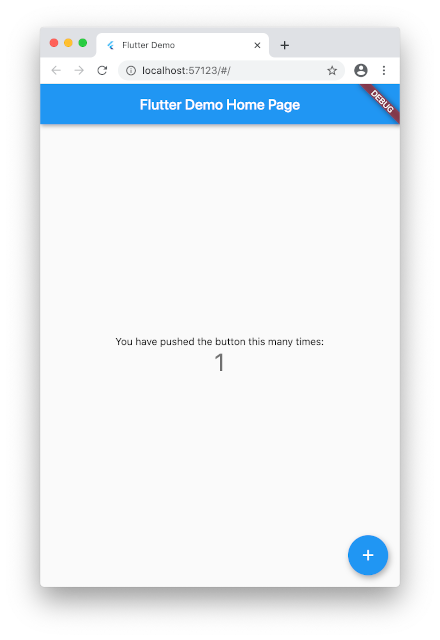

# Flutter 初心者向け講座 (ミニゲームを作ろう)

## はじめに
この講座では、flutter 標準のテンプレートアプリ(カウントアプリ)をベースに、  
**[DartPad](https://dartpad.dev/) でも実行できるミニゲーム** を作るための基本を学ぶ講座です。  
*初学者がつまづきがちな iOS や Android の環境構築を避けるため `flutter for web` を使います。*  
*Flutterアプリの開発を行いやすくするため `IntelliJ IDEA 統合開発環境` を使うことをお勧めします。*


<br/>

- 講座構成
  - [flutter for web 環境を作る](https://cch-robo.github.io/DevFest-Kyoto-2020/#flutter-for-web-%E7%92%B0%E5%A2%83%E3%82%92%E4%BD%9C%E3%82%8B)
  - [flutter for web ってなに？](https://cch-robo.github.io/DevFest-Kyoto-2020/#flutter-for-web-%E3%81%A3%E3%81%A6%E3%81%AA%E3%81%AB)
  - [Step 1-1: flutterプロジェクトを新規作成する](https://cch-robo.github.io/DevFest-Kyoto-2020/#step-1-1-flutter%E3%83%97%E3%83%AD%E3%82%B8%E3%82%A7%E3%82%AF%E3%83%88%E3%82%92%E6%96%B0%E8%A6%8F%E4%BD%9C%E6%88%90%E3%81%99%E3%82%8B)
  - [Step 1-2: テンプレートアプリの分割](https://cch-robo.github.io/DevFest-Kyoto-2020/#step-1-2-%E3%83%86%E3%83%B3%E3%83%97%E3%83%AC%E3%83%BC%E3%83%88%E3%82%A2%E3%83%97%E3%83%AA%E3%81%AE%E5%88%86%E5%89%B2)
  - [テンプレートアプリの構造 (flutterアプリの構成の基本)](https://cch-robo.github.io/DevFest-Kyoto-2020/#%E3%83%86%E3%83%B3%E3%83%97%E3%83%AC%E3%83%BC%E3%83%88%E3%82%A2%E3%83%97%E3%83%AA%E3%81%AE%E6%A7%8B%E9%80%A0-flutter%E3%82%A2%E3%83%97%E3%83%AA%E3%81%AE%E6%A7%8B%E6%88%90%E3%81%AE%E5%9F%BA%E6%9C%AC)
  - [flutter for web アプリのビルドとアプリ実行 (webアプリの動作確認)](https://cch-robo.github.io/DevFest-Kyoto-2020/#flutter-for-web-%E3%82%A2%E3%83%97%E3%83%AA%E3%81%AE%E3%83%93%E3%83%AB%E3%83%89%E3%81%A8%E3%82%A2%E3%83%97%E3%83%AA%E5%AE%9F%E8%A1%8C-web%E3%82%A2%E3%83%97%E3%83%AA%E3%81%AE%E5%8B%95%E4%BD%9C%E7%A2%BA%E8%AA%8D)
  - [flutter アプリのホットリロードとホットリスタート](https://cch-robo.github.io/DevFest-Kyoto-2020/#flutter-%E3%82%A2%E3%83%97%E3%83%AA%E3%81%AE%E3%83%9B%E3%83%83%E3%83%88%E3%83%AA%E3%83%AD%E3%83%BC%E3%83%89%E3%81%A8%E3%83%9B%E3%83%83%E3%83%88%E3%83%AA%E3%82%B9%E3%82%BF%E3%83%BC%E3%83%88)
  - [ゲームプレイに必要な、ボタン入力とアクション実行の基本](https://cch-robo.github.io/DevFest-Kyoto-2020/#%E3%82%B2%E3%83%BC%E3%83%A0%E3%83%97%E3%83%AC%E3%82%A4%E3%81%AB%E5%BF%85%E8%A6%81%E3%81%AA%E3%83%9C%E3%82%BF%E3%83%B3%E5%85%A5%E5%8A%9B%E3%81%A8%E3%82%A2%E3%82%AF%E3%82%B7%E3%83%A7%E3%83%B3%E5%AE%9F%E8%A1%8C%E3%81%AE%E5%9F%BA%E6%9C%AC)
  - [Step 2-1: providerパッケージを使った UI表示更新の基本](https://cch-robo.github.io/DevFest-Kyoto-2020/#step-2-1-provider%E3%83%91%E3%83%83%E3%82%B1%E3%83%BC%E3%82%B8%E3%82%92%E4%BD%BF%E3%81%A3%E3%81%9F-ui%E8%A1%A8%E7%A4%BA%E6%9B%B4%E6%96%B0%E3%81%AE%E5%9F%BA%E6%9C%AC)
  - [Step 2-2: providerパッケージを使った UI表示更新の基本２](https://cch-robo.github.io/DevFest-Kyoto-2020/#step-2-2-provider%E3%83%91%E3%83%83%E3%82%B1%E3%83%BC%E3%82%B8%E3%82%92%E4%BD%BF%E3%81%A3%E3%81%9F-ui%E8%A1%A8%E7%A4%BA%E6%9B%B4%E6%96%B0%E3%81%AE%E5%9F%BA%E6%9C%AC%EF%BC%92)
  - [Step 2-3: MVVMアーキテクチャを導入する (ビジネスロジックの分離)](https://cch-robo.github.io/DevFest-Kyoto-2020/#step-2-3-mvvm%E3%82%A2%E3%83%BC%E3%82%AD%E3%83%86%E3%82%AF%E3%83%81%E3%83%A3%E3%82%92%E5%B0%8E%E5%85%A5%E3%81%99%E3%82%8B-%E3%83%93%E3%82%B8%E3%83%8D%E3%82%B9%E3%83%AD%E3%82%B8%E3%83%83%E3%82%AF%E3%81%AE%E5%88%86%E9%9B%A2)
  - [Step 2-4: MVVMアーキテクチャを利用する (UI表示の連携)](https://cch-robo.github.io/DevFest-Kyoto-2020/#step-2-4-mvvm%E3%82%A2%E3%83%BC%E3%82%AD%E3%83%86%E3%82%AF%E3%83%81%E3%83%A3%E3%82%92%E5%88%A9%E7%94%A8%E3%81%99%E3%82%8B-ui%E8%A1%A8%E7%A4%BA%E3%81%AE%E9%80%A3%E6%90%BA)
  - [Step 2-5: デモ表示に必要な、指定時間ごとの処理実行方法](https://cch-robo.github.io/DevFest-Kyoto-2020/#step-2-5-%E3%83%87%E3%83%A2%E8%A1%A8%E7%A4%BA%E3%81%AB%E5%BF%85%E8%A6%81%E3%81%AA%E6%8C%87%E5%AE%9A%E6%99%82%E9%96%93%E3%81%94%E3%81%A8%E3%81%AE%E5%87%A6%E7%90%86%E5%AE%9F%E8%A1%8C%E6%96%B9%E6%B3%95)
  - [Step 2-6: デモの自動起動に必要な、独自の処理流れの起動方法](https://cch-robo.github.io/DevFest-Kyoto-2020/#step-2-6-%E3%83%87%E3%83%A2%E3%81%AE%E8%87%AA%E5%8B%95%E8%B5%B7%E5%8B%95%E3%81%AB%E5%BF%85%E8%A6%81%E3%81%AA%E7%8B%AC%E8%87%AA%E3%81%AE%E5%87%A6%E7%90%86%E6%B5%81%E3%82%8C%E3%81%AE%E8%B5%B7%E5%8B%95%E6%96%B9%E6%B3%95)
  - [Step 2-7: ゲームを賑やかにする、アニメーションの導入](https://cch-robo.github.io/DevFest-Kyoto-2020/#step-2-7-%E3%82%B2%E3%83%BC%E3%83%A0%E3%82%92%E8%B3%91%E3%82%84%E3%81%8B%E3%81%AB%E3%81%99%E3%82%8B%E3%82%A2%E3%83%8B%E3%83%A1%E3%83%BC%E3%82%B7%E3%83%A7%E3%83%B3%E3%81%AE%E5%B0%8E%E5%85%A5)
  - [Step 3-1〜3-3: 独自MVVMライブラリの紹介 (DartPadでも動作可能にする)](https://cch-robo.github.io/DevFest-Kyoto-2020/#step-3-13-3-%E7%8B%AC%E8%87%AAmvvm%E3%83%A9%E3%82%A4%E3%83%96%E3%83%A9%E3%83%AA%E3%81%AE%E7%B4%B9%E4%BB%8B-dartpad%E3%81%A7%E3%82%82%E5%8B%95%E4%BD%9C%E5%8F%AF%E8%83%BD%E3%81%AB%E3%81%99%E3%82%8B)
  - [ミニゲームを作ろう](https://cch-robo.github.io/DevFest-Kyoto-2020/#%E3%83%9F%E3%83%8B%E3%82%B2%E3%83%BC%E3%83%A0%E3%82%92%E4%BD%9C%E3%82%8D%E3%81%86)

<br/>
<br/>

----------
## flutter for web 環境を作る
環境構築については、[flutter for web 環境を作る](https://cch-robo.github.io/DevFest-Kyoto-2020/install_flutter_sdk.html) ページを参照  

<br/>
<br/>

----------
### flutter for web ってなに？


[Flutterを体験してみませんか](https://www.slideshare.net/cch-robo/flutter-238797825)

<br/>
<br/>

----------
### Step 1-1: flutterプロジェクトを新規作成する
flutterプロジェクトを新規作成して、テンプレートアプリ(カウントアプリ)のコード内容を確認しましょう。  

1. ターミナルを開き、`flutter create コマンド`で flutterプロジェクトを新規作成。  
1. `IntelliJ IDEA 統合開発環境`を起動して、新規作成プロジェクトをインポート。
1. `lib/main.dart`ファイルを開き、テンプレートアプリ(カウントアプリ)のコード内容を確認。
1. テンプレートアプリのコード内容確認後、講座リポジトリをクローン。 (後段作業はこちらをお使いください)

<br/>

```bash
# 1. flutterプロジェクトを新規作成するコマンド
flutter create --project-name "memojudge" GDG_Kyoto_DevFest_2020_sample

# `GDG_Kyoto_DevFest_2020_sample`というプロジェクト・ディレクトリが新規作成され、
# プロジェクト名が `memojudge` かつテンプレートアプリを伴った flutterプロジェクトが新規作成されます。
```

```bash
# 2. `IntelliJ IDEA 統合開発環境`を起動して、新規作成プロジェクトをインポート
#    実演するため割愛
```

```bash
# 3. `lib/main.dart`ファイルを開き、テンプレートアプリ(カウントアプリ)のコード内容を確認
#    実演するため割愛
```

<br/>

`lib/main.dart`ファイル内容例
```dart
import 'package:flutter/material.dart';

void main() {
  runApp(MyApp());
}

class MyApp extends StatelessWidget {
  // This widget is the root of your application.
  @override
  Widget build(BuildContext context) {
    return MaterialApp(
      title: 'Flutter Demo',
      theme: ThemeData(
        // This is the theme of your application.
        //
        // Try running your application with "flutter run". You'll see the
        // application has a blue toolbar. Then, without quitting the app, try
        // changing the primarySwatch below to Colors.green and then invoke
        // "hot reload" (press "r" in the console where you ran "flutter run",
        // or simply save your changes to "hot reload" in a Flutter IDE).
        // Notice that the counter didn't reset back to zero; the application
        // is not restarted.
        primarySwatch: Colors.blue,
        // This makes the visual density adapt to the platform that you run
        // the app on. For desktop platforms, the controls will be smaller and
        // closer together (more dense) than on mobile platforms.
        visualDensity: VisualDensity.adaptivePlatformDensity,
      ),
      home: MyHomePage(title: 'Flutter Demo Home Page'),
    );
  }
}

class MyHomePage extends StatefulWidget {
  MyHomePage({Key key, this.title}) : super(key: key);

  // This widget is the home page of your application. It is stateful, meaning
  // that it has a State object (defined below) that contains fields that affect
  // how it looks.

  // This class is the configuration for the state. It holds the values (in this
  // case the title) provided by the parent (in this case the App widget) and
  // used by the build method of the State. Fields in a Widget subclass are
  // always marked "final".

  final String title;

  @override
  _MyHomePageState createState() => _MyHomePageState();
}

class _MyHomePageState extends State<MyHomePage> {
  int _counter = 0;

  void _incrementCounter() {
    setState(() {
      // This call to setState tells the Flutter framework that something has
      // changed in this State, which causes it to rerun the build method below
      // so that the display can reflect the updated values. If we changed
      // _counter without calling setState(), then the build method would not be
      // called again, and so nothing would appear to happen.
      _counter++;
    });
  }

  @override
  Widget build(BuildContext context) {
    // This method is rerun every time setState is called, for instance as done
    // by the _incrementCounter method above.
    //
    // The Flutter framework has been optimized to make rerunning build methods
    // fast, so that you can just rebuild anything that needs updating rather
    // than having to individually change instances of widgets.
    return Scaffold(
      appBar: AppBar(
        // Here we take the value from the MyHomePage object that was created by
        // the App.build method, and use it to set our appbar title.
        title: Text(widget.title),
      ),
      body: Center(
        // Center is a layout widget. It takes a single child and positions it
        // in the middle of the parent.
        child: Column(
          // Column is also a layout widget. It takes a list of children and
          // arranges them vertically. By default, it sizes itself to fit its
          // children horizontally, and tries to be as tall as its parent.
          //
          // Invoke "debug painting" (press "p" in the console, choose the
          // "Toggle Debug Paint" action from the Flutter Inspector in Android
          // Studio, or the "Toggle Debug Paint" command in Visual Studio Code)
          // to see the wireframe for each widget.
          //
          // Column has various properties to control how it sizes itself and
          // how it positions its children. Here we use mainAxisAlignment to
          // center the children vertically; the main axis here is the vertical
          // axis because Columns are vertical (the cross axis would be
          // horizontal).
          mainAxisAlignment: MainAxisAlignment.center,
          children: <Widget>[
            Text(
              'You have pushed the button this many times:',
            ),
            Text(
              '$_counter',
              style: Theme.of(context).textTheme.headline4,
            ),
          ],
        ),
      ),
      floatingActionButton: FloatingActionButton(
        onPressed: _incrementCounter,
        tooltip: 'Increment',
        child: Icon(Icons.add),
      ), // This trailing comma makes auto-formatting nicer for build methods.
    );
  }
}
```

<br/>

```bash
# 4. 講座リポジトリをクローン

# github リポジトリをクローン
$ git clone https://github.com/cch-robo/DevFest-Kyoto-2020.git
```

<br/>
<br/>

----------
### Step 1-2: テンプレートアプリの分割
`lib/main.dart`ファイルは、アプリを起動する`main関数`と `アプリ実態クラス`が一体になっているので分割します。  

1. 講座ステップごとにソースコードが差し替えられるよう、`アプリ実態クラス`を `lib/src/app.dart`に分離。  
*アプリ実態クラス ⇒ `MyApp`、`MyHome`、`_MyHomePageState` (コードに集中できるよう冗長なコメントは削除)*  
2. `lib/main.dart`は、アプリを起動する `main関数`のみを残すように簡素化。  

<br/>

修正：[`lib/main.dart`](https://github.com/cch-robo/DevFest-Kyoto-2020/blob/master/lib/src/step1_2/main.dart) [(ダウンロード)](./project/lib/src/step1_2/main.dart)

```dart
import 'package:memojudge/src/app.dart';

void main() {
  startApp();
}
```

<br/>

新規作成：[`lib/src/app.dart`](https://github.com/cch-robo/DevFest-Kyoto-2020/blob/master/lib/src/step1_2/app.dart) [(ダウンロード)](./project/lib/src/step1_2/app.dart)

```dart
import 'package:flutter/material.dart';

/// step1-2
void startApp() {
  runApp(MyApp());
}

class MyApp extends StatelessWidget {
  @override
  Widget build(BuildContext context) {
    return MaterialApp(
      title: 'Flutter Demo',
      theme: ThemeData(
        primarySwatch: Colors.blue,
        visualDensity: VisualDensity.adaptivePlatformDensity,
      ),
      home: MyHomePage(title: 'Flutter Demo Home Page'),
    );
  }
}

class MyHomePage extends StatefulWidget {
  MyHomePage({Key key, this.title}) : super(key: key);
  final String title;

  @override
  _MyHomePageState createState() => _MyHomePageState();
}

class _MyHomePageState extends State<MyHomePage> {
  int _counter = 0;

  void _incrementCounter() {
    setState(() {
      _counter++;
    });
  }

  @override
  Widget build(BuildContext context) {
    return Scaffold(
      appBar: AppBar(
        title: Text(widget.title),
      ),
      body: Center(
        child: Column(
          mainAxisAlignment: MainAxisAlignment.center,
          children: <Widget>[
            Text(
              'You have pushed the button this many times:',
            ),
            Text(
              '$_counter',
              style: Theme.of(context).textTheme.headline4,
            ),
          ],
        ),
      ),
      floatingActionButton: FloatingActionButton(
        onPressed: _incrementCounter,
        tooltip: 'Increment',
        child: Icon(Icons.add),
      ),
    );
  }
}
```

<br/>
<br/>

----------
### テンプレートアプリの構造 (flutterアプリの構成の基本)
1. flutter アプリの骨組みは、**ウィジェットツリー**で作られています。  
**ウィジェットツリー**とは、1つの根(**ルートウィジェット**)から枝分かれしていく樹状図です。  
枝分かれする各接点には、**ウィジェット**と呼ばれる Flutterフレームワーク基盤パーツが配置されます。

1. flutterのウィジェットツリーは、大まかに、**アプリ**、**ページ**、**ビュー** の役割階層に分かれていると考えましょう。  
アプリ：アプリ名や アプリ全体のテーマ指定などの 設定を担います。  
ページ：タイトルバーや ページボディなどの ページ表示を担います。  
ビュー：ボタンや テキスト表示や レイアウトなどの UI表示を担います。  
*ウィジェットツリーの構造は、アプリ ⊃ ページ ⊃ ビューの関係になっていることと、*  
*上流に行くほど生存期間が長くなり、上流は下流の生存期間を包含していることも忘れないでください。*  

1. 各ウィジェットは、 **特定機能** や **情報の器** を提供する役割に分かれていると考えましょう。  
特定機能：**ページ表示**や **押しボタン**や **テキストの表示**および **レイアウト**…など。  
情報の器：子ウィジェット(特定機能)に伝える、任意情報(状態や関数)の保持と仲介役を担います。  

<br/>

- **テンプレートアプリのウィジェットツリー構成概要**

```
           [MyApp] ← アプリの器 (仲介情報なし)
              |
        [MaterialApp] ← アプリ設定の機能を提供
              |
         [MyHomePage] ← ページの器 (カウント状態やページタイトル情報を仲介)
              |
         [ Scaffold ] ← ページ表示の機能を提供
        /     |      \
[AppBar]   [Center]   [FloatingActionButton] ← ボタン機能を提供 (ビュー)
              |
           [Column] ← レイアウト機能を提供 (ビュー)
          /        \
 [Text(1)]         [Text(2)] ← テキスト表示機能を提供 (ビュー)
```

<br/>

- 基本的なウィジェットの一覧については、公式資料ページの [Basic widgets](https://flutter.dev/docs/development/ui/widgets/basics) を参照ください。  
機能別ウィジェット一覧については、[Widget catalog](https://flutter.dev/docs/development/ui/widgets) を参照ください。  
ウィジェット全般の一覧については、[Flutter widget index](https://flutter.dev/docs/reference/widgets) を参照ください。

<br/>
<br/>

----------
### flutter for web アプリのビルドとアプリ実行 (webアプリの動作確認)
テンプレートアプリ(カウントアプリ)をビルドして動作を確認してみましょう。  
flutter for web では、アプリを webアプリとしてビルドさせ、Chromeブラウザで実行させます。  

*webアプリ動作確認の実態は、ビルドした webアプリの ローカルホストでのホスティングです。*  
*Chromeブラウザは、ローカルホストにホスティングされた index.html を表示させています。*

<br/>

- テンプレートアプリ(カウンタアプリ)の動作確認  
Chromeブラウザ画面の右下 (＋)アイコンをクリックすると、画面中央のカウンタが増加します。



<br/>

- ターミナルでの動作確認手順  
1.ターミナルを開いて、プロジェクト・ディレクトリに移動。  
2.テンプレートアプリを web アプリとしてビルド。  
3.Chrome ブラウザを起動して、web アプリを実行。  
　*ビルドを終了させて、Chromeブラウザを起動します。*

```bash
# 1. ターミナルを開いて、プロジェクト・ディレクトリに移動。

# プロジェクトのディレクトリに移動
$ cd (プロジェクト・ディレクトリ)
```

```bash
# 2. テンプレートアプリを web アプリとしてビルド。

# プロジェクトで使えるパッケージを最新化
$ flutter pub get

# プロジェクトのビルド済のアプリをクリア
$ flutter clean

# プロジェクトを web アプリとしてビルド
$ flutter build web
```

```bash
# 2. Chromeブラウザを起動して、web アプリを実行。 

# web アプリを Chrome ブラウザで実行
$ flutter run -d chrome
```

<br/>

- IntelliJ IDEA 統合開発環境での動作確認手順  
1.テンプレートアプリを web アプリとしてビルドして、Chrome ブラウザで web アプリを実行。  
　赤枠の左端から **Chrome (web)**を選択、**main.dart**を選択して、右端の緑三角アイコンをクリック。  
　*ビルドが終了すると、Chromeブラウザが起動します。*


<br/>
<br/>

----------
### flutter アプリのホットリロードとホットリスタート
`flutter for web アプリのビルドとアプリ実行`で、アプリのビルドには時間がかかることを確認されたと思います。  
flutterには、コードを変更してもアプリ全体を再ビルドすることなく、変更分のみを差し替え、迅速に反映させる  
**ホットリロード(Hot Reload)** と **ホットリスタート(Hot Restart)** という機能があります。

- ホットリロードと ホットリスタートの違い  
**ホットリロード** は、変更を反映するためにアプリの再表示を行います。  
**ホットリスタート** は、変更を反映するためにアプリの起動からやり直します。

<br/>

- ターミナルでの ホットリロードと ホットリスタートの手順  
1.`flutter for web アプリのビルドとアプリ実行`に従って、  
　`flutter build web`と`flutter run -d chrome`を実行してアプリを起動。  
2.コードの変更を行ない、ターミナルに `r` を入力すればホットリロードが実行されます。  
3.コードの変更を行ない、ターミナルに `R` を入力すればホットリスタートが実行されます。  

<br/>

- IntelliJ IDEA 統合開発環境での ホットリロードと ホットリスタートの手順  
1.`flutter for web アプリのビルドとアプリ実行`に従って、緑三角アイコンをクリック。  
2.コードの変更を行ない、赤枠のアイコンをクリックすればホットリロードが実行されます。  
3.コードの変更を行ない、青枠のアイコンをクリックすればホットリスタートが実行されます。  


<br/>

テンプレートアプリのビルドと Chromeブラウザでの動作確認ができたので、  
テンプレートアプリ(カウントアプリ)のコードを変更して、動作の変化を確認してみましょう。  

アプリは、`_MyHomePageState`クラスの先頭の`_counter`変数でカウンタ数を管理し、  
`_incrementCounter`関数でボタンクリックごとにカウンタ数を+1させていますので、  
ここのコードを変更して、ホットリロードや ホットリスタートを実行してみてください。

```dart
  int _counter = 0;          // ← カウンタ数を保管する変数（初期値は0）
                             // 
  void _incrementCounter() { // ← カウンタを増加させる関数
    setState(() {            // 
      _counter++;            // ← 変数のカウンタ数を+1している。
    });                      // 
  }                          // 
```

<br/>
<br/>

----------
### ゲームプレイに必要な、ボタン入力とアクション実行の基本
テンプレートアプリ(カウンタアプリ)は、ボタンクリックでカウント数が増加します。  
つまり「ボタンを押せばジャンプする」ような、ゲームプレイに必要な **ボタン入力と アクション実行** の基本が作りこまれています。

**ボタン入力と アクション実行** の基本実装は、  
[FloatingActionButton](https://api.flutter.dev/flutter/material/FloatingActionButton-class.html) ⇒ ボタン・ウィジェットの `onPressed`プロパティに、アクション先の関数を指定するだけです。  
この指定により、ボタンクリック時にアクション関数が実行されることになります。

```dart
// ＝＝＝＝＝＝＝＝＝＝＝＝＝＝＝＝＝＝＝＝
// ボタン入力とアクション関数のコード部抜粋
// ＝＝＝＝＝＝＝＝＝＝＝＝＝＝＝＝＝＝＝＝

  // フローティングアクションボタン
  floatingActionButton: FloatingActionButton(
    onPressed: _incrementCounter, // カウント増加関数をアクション先に指定
    tooltip: 'Increment',
    child: Icon(Icons.add),
  ),

  // カウント数増加関数
  void _incrementCounter() {
    setState(() {
      _counter++;
    });
  }
```

<br/>

- [Flutter](https://flutter.dev/) が利用する [Dart言語](https://dart.dev/) での 関数についての注意事項

- 関数は [Functionクラス](https://api.dart.dev/stable/2.10.1/dart-core/Function-class.html) のオブジェクトです。  
つまり関数は、関数オブジェクトなので、変数に直接定義したり代入でき、引数に指定することもできます。

```dart
  // 変数に「値を返さなず引数のない関数型」の _incrementCounter を代入する。
  void Function() incrementCounterVariable = _incrementCounter;

  // 変数に、関数を直接定義することもできる。
  void Function() incrementCounterVariable2 = () {
    setState(() { _counter++; });
  };

  // フローティングアクションボタン
  floatingActionButton: FloatingActionButton(
    onPressed: incrementCounterVariable, // 関数を代入した変数をアクション先に指定
    tooltip: 'Increment',
    child: Icon(Icons.add),
  ),

  // 〜 以降省略 〜
```

<br/>

- Dart言語では、式を1つだけ含む関数の場合、**arrow syntax/アロー構文** という `=> 式` の表記で関数を簡略定義できます。

```dart
  // 変数に、関数を直接定義することもできる。（簡略定義版）
  void Function() incrementCounterVariable2 = () => setState(() { _counter++; });

  // フローティングアクションボタン
  floatingActionButton: FloatingActionButton(
    onPressed: () => _incrementCounter(), // アロー構文の関数をアクション先に指定
    child: Icon(Icons.add),
  ),

  // 〜 以降省略 〜
```

<br/>

 `_incrementCounter`と `()=>_incrementCounter()` はどう違うの？

<br/>
<br/>

----------
### Step 2-1: providerパッケージを使った UI表示更新の基本
テンプレートアプリ(カウンタアプリ)には、問題が２つあります。  
1. ボタンクリックごとに変化するのは、カウント数表示だけですが、常にページ全体を再描画させています。
1. ページ自体の関心事は、カウント数表示ではないのに、カウント値と カウント増加関数をページに定義しています。

この問題は、昔から`flutterでの状態管理`の課題として議論されていました。  
現在の flutter公式サイトでは、[Simple app state management](https://flutter.dev/docs/development/data-and-backend/state-mgmt/simple) ページを設けて、[provider](https://pub.dev/packages/provider) パッケージを使った解決方法が紹介されています。

- [provider](https://pub.dev/packages/provider) パッケージを使うと、  
カウントを関心事とする以下のようなモデルを作ることができます。

1. 関心事として、カウント値と カウント増加関数のみを定義したモデルである。  
1. カウント数表示部で、モデルのカウント値が参照できる。  
ボタンクリックのイベント先で、モデルのカウント増加関数が利用できる。  
1. モデルから 状況変化を通知して、カウント表示部に再描画(表示更新)をしてもらえる。  
(依存関係が単方向であり、モデルは、ボタンやカウント表示部 ⇒ ビュー層の存在を知らない)  
1. モデルは、ボタンやカウント表示部から利用されるので、それらの生存期間を包含した生存期間にできる。  

- [provider](https://pub.dev/packages/provider) パッケージは、
ビューに状況変化を通知できるよう [ChangeNotifier クラス](https://api.flutter.dev/flutter/foundation/ChangeNotifier-class.html) を継承したモデルのオブジェクトを 
[ChangeNotifierProvider クラス](https://pub.dev/documentation/provider/latest/provider/ChangeNotifierProvider-class.html) に登録することで、
[BuildContext#read()](https://pub.dev/documentation/provider/latest/provider/ReadContext.html) で モデルのオブジェクトを参照でき、
[Consumer クラス](https://pub.dev/documentation/provider/latest/provider/Consumer-class.html) や 
[BuildContext#watch()](https://pub.dev/documentation/provider/latest/provider/WatchContext.html) で モデルのオブジェクトの参照と 通知によるビューの再描画ができるようにしてくれます。  
サンプルでは、情報の器となる `MyHomeProviderクラス`が 複数のプロバイダーを扱えるよう [MultiProvider クラス](https://pub.dev/documentation/provider/latest/provider/MultiProvider-class.html) でラップしています。

- providerパッケージの中身は複雑ですので、  
ここでは「表示の関心事をモデルに分離して、ビューを再描画させることができる」という理解で構いません。  

<br/>

テンプレートアプリ(カウントアプリ)に [provider](https://pub.dev/packages/provider) パッケージを導入して、  
カウント関心事を `MyHome`ページから モデルに分離する手順概要は、以下の通りです。
1. プロジェクトのパッケージ設定ファイル `pubspec.yaml` に providerパッケージを追加。  
1. 追加した provider パッケージをプロジェクトにインポート。  
1. アプリのソースファイル `lib/src/app.dart`を providerパッケージ対応に修正。 
1. モデルを提供する`MyHomeProvider`と カウンタ値とカウンタ関数を提供する`CountViewModel`を新規追加。  
1. `MyApp`の`home:`プロパティ先を `MyHomeProvider`に変更。  
1. `MyHomePage`を `StatelessWidget`継承に変更し、  
`CountViewModel`に移設された `_MyHomePageState`のプロパティとカウント関数のコードを削除。  

<br/>

- `dependencies:`セクションに、`　provider:  ^4.3.2+2` を追加。  
*インデントが崩れないよう`provider:`の先頭には半角スペースを 2つ入れます。*  

```pubspec
dependencies:
  flutter:
    sdk: flutter
```


```pubspec
dependencies:
  flutter:
    sdk: flutter

  # デファクトスタンダードな状態管理ライブラリ (step2 で利用します)
  # 詳細URL https://pub.dev/packages/provider
  provider: ^4.3.2+2
```

<br/>

- `pubspec.yaml`修正内容：  
修正前：[`pubspec.yaml`](https://github.com/cch-robo/DevFest-Kyoto-2020/blob/master/lib/src/step1_2/pubspec.yaml) [(ダウンロード)](./project/lib/src/step1_2/pubspec.yaml)  
修正後：[`pubspec.yaml`](https://github.com/cch-robo/DevFest-Kyoto-2020/blob/master/lib/src/step2_1/pubspec.yaml) [(ダウンロード)](./project/lib/src/step2_1/pubspec.yaml)  

<br/>

- 追加した provider パッケージをプロジェクトにインポート。

```bash
# プロジェクトで使えるパッケージを最新化
$ flutter pub get
```

<br/>

- インポート宣言部に `provider`パッケージを新規追加。  

```dart
import 'package:flutter/material.dart';
```


```dart
import 'package:flutter/material.dart';
import 'package:provider/provider.dart';
```

<br/>

- モデルを提供する`MyHomeProvider`と カウンタ値とカウンタ関数を提供する`CountViewModel`を新規追加  

```dart
/// ページ全体にモデル（ビジネスロジックとデータ）を提供する Provider
class MyHomeProvider {
  Widget create() {
    return MultiProvider(
      providers: [
        ChangeNotifierProvider(create: (context) => CountViewModel()),
      ],
      child: const MyHomePage(title: 'Flutter Demo Home Page'),
    );
  }
}

/// カウントの UI表示に関する、値とロジックを提供する ViewModel
class CountViewModel with ChangeNotifier {
  int _count = 0;
  int get count => _count;

  void incrementCounter() {
    _count++;
    notifyListeners();
  }
}
```

<br/>

 なんで `MyHomeProvider`は、`MyHomePage`を子ウィジェットにしているの？

<br/>

- `MyApp`の`home:`プロパティ先を `MyHomeProvider`に変更。  

```dart
class MyApp extends StatelessWidget {
  @override
  Widget build(BuildContext context) {
    return MaterialApp(
      title: 'Flutter Demo',
      theme: ThemeData(
        primarySwatch: Colors.blue,
        visualDensity: VisualDensity.adaptivePlatformDensity,
      ),
      home: const MyHomePage(title: 'Flutter Demo Home Page'),
    );
  }
}
```


```dart
class MyApp extends StatelessWidget {
  @override
  Widget build(BuildContext context) {
    return MaterialApp(
      title: 'Flutter Demo',
      theme: ThemeData(
        primarySwatch: Colors.blue,
        visualDensity: VisualDensity.adaptivePlatformDensity,
      ),
      home: MyHomeProvider().create(),
    );
  }
}
```

<br/>

- `MyHomePage`を `StatelessWidget`継承に変更し、  
`CountViewModel`に移設された `_MyHomePageState`のプロパティとカウント関数のコードを削除。  

```dart
class MyHomePage extends StatefulWidget {
  MyHomePage({Key key, this.title}) : super(key: key);
  final String title;

  @override
  _MyHomePageState createState() => _MyHomePageState();
}

class _MyHomePageState extends State<MyHomePage> {
  int _counter = 0;

  void _incrementCounter() {
    setState(() {
      _counter++;
    });
  }

```


```dart
class MyHomePage extends StatelessWidget {
  const MyHomePage({Key key, this.title}) : super(key: key);
  final String title;

```

<br/>

- アプリバーに表示されるテキストを `MyHomePage`の `title`プロパティの直接参照に修正。  
*この修正は、`MyHomePage`の継承元が `StatelessWidget`に変更されたために行います。*  

```dart
      appBar: AppBar(
        title: Text(widget.title),
      ),
```


```dart
      appBar: AppBar(
        title: Text(title),
      ),
```

<br/>

- `Text`ウィジェットのカウント表示を providerと連携する`Consumer`ウィジェットで取り込み、  
`CountViewModel`の `count`プロパティから カウント数を参照するように修正。  

```dart
            Text(
              '$_counter',
              style: Theme.of(context).textTheme.headline4,
            ),
```


```dart
            // カウントの UI表示を行う View
            Consumer<CountViewModel>(
              builder: (context, model, child) {
                return Text(
                  '${model.count}',
                  style: Theme.of(context).textTheme.headline4,
                );
              },
            ),
```

<br/>

- `onPressed`プロパティを providerと連携する`BuildeContext#read()`拡張メソッドでつないだ、  
`CountViewModel`の `incrementCounter`関数を利用するように修正。  

```dart
      floatingActionButton: FloatingActionButton(
        onPressed: _incrementCounter,
        tooltip: 'Increment',
        child: Icon(Icons.add),
      ),
```


```dart
      floatingActionButton: FloatingActionButton(
        onPressed: () => context.read<CountViewModel>().incrementCounter(),
        tooltip: 'Increment',
        child: const Icon(Icons.add),
      ),
```

<br/>

- `lib/src/app.dart`修正内容：  
修正前全コード：[`lib/src/app.dart`](https://github.com/cch-robo/DevFest-Kyoto-2020/blob/master/lib/src/step1_2/app.dart) [(ダウンロード)](./project/lib/src/step1_2/app.dart)  
修正後全コード：[`lib/src/app.dart`](https://github.com/cch-robo/DevFest-Kyoto-2020/blob/master/lib/src/step2_1/app.dart) [(ダウンロード)](./project/lib/src/step2_1/app.dart)  

<br/>
<br/>

----------
### Step 2-2: providerパッケージを使った UI表示更新の基本２
`Step 2-1`では、モデルからの通知でカウント表示を再描画できるように [Consumer クラス](https://pub.dev/documentation/provider/latest/provider/Consumer-class.html) を使っています。  
[BuildContext#watch()](https://pub.dev/documentation/provider/latest/provider/WatchContext.html) を使えば、モデルからの通知で再描画する独自ウィジェットが作れますので、  
カウント表示のみを行う `CountView`ウィジェットを作成してみましょう。

<br/>

- カウント表示のみを行う `CountView`ウィジェットを新規作成  
*`build`関数内での `context.watch<CountViewModel>()`により、*  
*`CountViewModel`からの通知で 再描画(build関数呼出)されるようになります。*

```dart
/// カウントの UI表示を行う View
class CountView extends StatelessWidget {
  const CountView({Key key}) : super(key: key);

  @override
  Widget build(BuildContext context) {
    return Text(
      '${context.watch<CountViewModel>().count}',
      style: Theme.of(context).textTheme.headline4,
    );
  }
}
```

<br/>

- カウント表示部を`Consumer`から `CountView`ウィジェットに変更

```dart
            // カウントの UI表示を行う View
            Consumer<CountViewModel>(
              builder: (context, model, child) {
                return Text(
                  '${model.count}',
                  style: Theme.of(context).textTheme.headline4,
                );
              },
            ),
```


```dart
            // カウントの UI表示を行う View
            CountView(),
```

<br/>

- `lib/src/app.dart`修正内容：  
修正前全コード：[`lib/src/app.dart`](https://github.com/cch-robo/DevFest-Kyoto-2020/blob/master/lib/src/step2_1/app.dart) [(ダウンロード)](./project/lib/src/step2_1/app.dart)  
修正後全コード：[`lib/src/app.dart`](https://github.com/cch-robo/DevFest-Kyoto-2020/blob/master/lib/src/step2_2/app.dart) [(ダウンロード)](./project/lib/src/step2_2/app.dart)  

<br/>
<br/>

----------
### Step 2-3: MVVMアーキテクチャを導入する (ビジネスロジックの分離)
providerパッケージで、表示と連携したカウントを関心事とするモデルを作りましたが、  
カウント値やカウント増加関数は、カウント表示のための関心事ではなく、もっと純粋な関心事と考えることもできます。  

**MVVM (Model - View - View Model) アーキテクチャ**で、カウントの関心事を表示から引き剥がして、  
純粋にカウントのみを関心事とするモデルを作ってみましょう。

**MVVMアーキテクチャ**は、  
**View** (表示⇒Widget) と、**View Model** (Viewが参照するモデル) と、**Model** (表示に関与しないモデル) のコンポーネントで、  
プロパティ参照とコマンド実行の流れと、変更通知の流れを単方向にすることで、**Model**が外部都合に影響されないようにします。

- ここではモデル(View Model、Model)は、プロパティ参照とコマンド(値を返さない)を公開するとします。
- プロパティ参照やコマンド実行の流れは View → View Model → Model の単方向。  
通知の流れは、Model → View Model → View の逆向きの単方向になっています。
  - View が View Model の持つプロパティの参照やコマンドの実行を行い、  
  View Model が Model の持つプロパティの参照やコマンドの実行を行う。
  - Model が View Model に状態更新の通知を送り、View Model が View に状態変更の通知を送る。
- プロパティ参照やコマンド実行の流れが単方向なので、Modelは、外部(View ModelとView)の存在を知りません。  
Modelは、外部からの都合を受けないので、純粋なドメインモデル(関心事のビジネスロジックやデータのみ)にできます。
- 一般的に MVVM パターンにすることで、ドメインモデルの拡張性や テストのしやすさが向上すると言われています。

<br/>

  
[画像参照元）https://docs.microsoft.com/en-us/xamarin/xamarin-forms/enterprise-application-patterns/mvvm-images/mvvm.png](https://docs.microsoft.com/en-us/xamarin/xamarin-forms/enterprise-application-patterns/mvvm-images/mvvm.png)  

- [The Model-View-ViewModel Pattern](https://docs.microsoft.com/en-us/xamarin/xamarin-forms/enterprise-application-patterns/mvvm#the-mvvm-pattern)  
- [モデルビュービューモデルパターン](https://docs.microsoft.com/ja-jp/xamarin/xamarin-forms/enterprise-application-patterns/mvvm)  

- **View Model**  
意訳：データバインドさせるプロパティとコマンドを実装し、変更通知イベントを通じて状態の変更をバインド先に通知します。
> The view model implements properties and commands to which the view can data bind to, 
> and notifies the view of any state changes through change notification events. 
> The properties and commands that the view model provides define the functionality 
> to be offered by the UI, but the view determines how that functionality is to be displayed.

- **View**  
意訳：ユーザーが画面に表示するものの構造、レイアウト、および外観を定義します。  
意訳：バインドしたビューモデルが提供するプロパティとコマンドを利用して、表示方法を決定します。
> The view is responsible for defining the structure, layout, 
> and appearance of what the user sees on screen.

- **Model**  
意訳：ドメインモデルを表し、ドメインをカプセル化する  
意訳：データとビジネスロジックを伴った非ビジュアルなクラスです。  
> Model classes are non-visual classes that encapsulate the app's data. 
> Therefore, the model can be thought of as representing the app's domain model, 
> which usually includes a data model along with business and validation logic.

<br/>

**MVVM アーキテクチャ**を導入して、カウントの関心事を表示から引き剥がす手順概要は、以下の通りです。
1. Model/ViewModel作成を支援する独自ライブラリ `lib/src/library/model_mixin.dart` のインポート追加
1. カウントのみを関心事とする `CountModel`を新規作成
1. `CountViewModel`を MVVMパターンの View Model 対応に修正
1. `MyHomeProvider`に `CountModel`の生成と `CountViewModel`への受渡を追加
1. `CountViewModel`のMVVM対応に伴い `onPressed`プロパティのハンドラ先を修正。

<br/>

- Model/ViewModel作成を支援する独自ライブラリ `lib/src/library/model_mixin.dart` のインポート追加  
*独自ライブラリは、Modelを表す `Model`と View Modelを表す `ViewModel`の **mixin**を提供します。*

```dart
import 'package:flutter/material.dart';
import 'package:provider/provider.dart';
```


```dart
import 'package:flutter/material.dart';
import 'package:provider/provider.dart';
import 'package:memojudge/src/library/model_mixin.dart';
```

<br/>

- カウントのみを関心事とする `CountModel`を新規作成

```dart
/// カウントを管理する Model
class CountModel with Model {
  int _count = 0;
  int get count => _count;

  void incrementCounter() {
    _count++;
    updateViewModels();
  }
}
```

<br/>

- `CountViewModel`を MVVMパターンの View Model 対応に修正  
*ViewMoel Mixinを多重継承させ、Modelのバインドや通知対応の追加およびプロパティ＋コマンドの参照に変更します。*  
*この修正により`CountViewModel`の関心事が、`CountModel`の従属に変わっています。*

```dart
/// カウントの UI表示に関する、値とロジックを提供する ViewModel
class CountViewModel with ChangeNotifier {
  int _count = 0;
  int get count => _count;

  void incrementCounter() {
    _count++;
    notifyListeners();
  }
}
```


```dart
/// カウントの UI表示に関する、プロパティとコマンドを提供する ViewModel
class CountViewModel with ChangeNotifier, ViewModel {
  final CountModel countModel;
  CountViewModel(this.countModel) {
    countModel.bindUpdate(onUpdate);
  }

  int get count => countModel.count;

  void updateCount() {
    countModel.incrementCounter();
  }

  @override
  void onUpdate(Model model) {
    if (model?.hashCode == countModel.hashCode ?? false) {
      notifyListeners();
    }
  }
}
```

<br/>

- `MyHomeProvider`に `CountModel`の生成と `CountViewModel`への受渡を追加

```dart
/// ページ全体にモデル（ビジネスロジックとデータモデル）を提供する Provider
class MyHomeProvider {
  Widget create() {
    return MultiProvider(
      providers: [
        ChangeNotifierProvider(create: (context) => CountViewModel()),
      ],
      child: const MyHomePage(title: 'Flutter Demo Home Page'),
    );
  }
}
```


```dart
/// ページ全体にモデル（ビジネスロジックとデータモデル）を提供する Provider
class MyHomeProvider {
  CountModel countModel;
  CountViewModel count;

  Widget create() {
    countModel = CountModel();
    count = CountViewModel(countModel);
    return MultiProvider(
      providers: [
        ChangeNotifierProvider(create: (context) => count),
      ],
      child: const MyHomePage(title: 'Flutter Demo Home Page'),
    );
  }
}
```

<br/>

- `CountViewModel`のMVVM対応に伴い `onPressed`プロパティのハンドラ先を修正

```dart
      floatingActionButton: FloatingActionButton(
        onPressed: () => context.read<CountViewModel>().incrementCounter(),
        tooltip: 'Increment',
        child: const Icon(Icons.add),
      ),
```


```dart
      floatingActionButton: FloatingActionButton(
        onPressed: () => context.read<CountViewModel>().updateCount(),
        tooltip: 'Increment',
        child: const Icon(Icons.add),
      ),
```

<br/>

- `lib/src/app.dart`修正内容：  
修正前全コード：[`lib/src/app.dart`](https://github.com/cch-robo/DevFest-Kyoto-2020/blob/master/lib/src/step2_2/app.dart) [(ダウンロード)](./project/lib/src/step2_2/app.dart)  
修正後全コード：[`lib/src/app.dart`](https://github.com/cch-robo/DevFest-Kyoto-2020/blob/master/lib/src/step2_3/app.dart) [(ダウンロード)](./project/lib/src/step2_3/app.dart)  

<br/>

- `lib/src/library/model_mixin.dart` ライブラリ：  
ライブラリ：[`lib/src/app.dart`](https://github.com/cch-robo/DevFest-Kyoto-2020/blob/master/lib/src/library/model_mixin.dart) [(ダウンロード)](./project/lib/src/library/model_mixin.dart)  

- `lib/src/library/model_mixin.dart` ライブラリ全内容：  

```dart
/// UI表現モデルを更新させるための関数型
typedef UpdateViewModel = void Function(Model model);

/// ビジネスロジックとデータモデルを提供する、ドメインモデルを定義する基盤クラス。
mixin Model {
  final List<UpdateViewModel> _updateViewModels = [];

  /// UI表現モデル更新関数を登録する。
  void bindUpdate(UpdateViewModel updateViewModel) {
    if (updateViewModel != null) {
      _updateViewModels.add(updateViewModel);
    }
  }

  /// UI表現モデル更新関数を削除する。
  void unbindUpdate(UpdateViewModel updateViewModel) {
    if (updateViewModel != null) {
      _updateViewModels.remove(updateViewModel);
    }
  }

  /// UI表現モデルを更新する。
  void updateViewModels() {
    for (UpdateViewModel update in _updateViewModels) {
      update(this);
    }
  }
}

mixin ViewModel {
  /// UI個別表現の状態を更新するハンドラ。
  void onUpdate(Model model) {}

  /// モデルと更新ハンドラをバインドする。
  void bindModel(Model model) {
    model.bindUpdate(onUpdate);
  }

  /// モデルと更新ハンドラをアンバインドする。
  void unbindModel(Model model) {
    model.unbindUpdate(onUpdate);
  }
}
```

<br/>
<br/>

----------
### Step 2-4: MVVMアーキテクチャを利用する (UI表示の連携)
カウント表示の関心事を`CountViewModel`から引き剥がして、純粋にカウントのみを関心事とする`CountModel`を作りましたが、  
これだけでは実装が増えただけです。  

MVVMパターンでは、全体の関心事に専念できる(外部都合の影響を受けない) Model が作れ、全体の関心事と表示を分離します。  
これは、全体の関心事の実装を変更することなく、全体の関心事にあわせた、新しい表示ルールが追加できることでもあります。  

MVVMパターンの効果として、`CountModel`も `CountViewModel`も変更することなく、  
10カウントごとに、表示更新を行わせる `TenCounterViewModel`と、画面に**CLEAR**を表示させる `TenCounterView` の追加で、  
**カウント表示**と **CLEAR表示**が連携した 新しい表示ルールを作れることを確認してみましょう。

<br/>

- 修正版テンプレートアプリ(カウンタアプリ)の動作確認  
10カウントごとに、カウント数の上に *CLEAR* が表示されます。


<br/>

10カウントごとに **CLEAR**表示を追加する修正手順概要は、以下の通りです。
1. 10カウントごとに UI表示を更新させる `TenCounterViewModel`を新規作成。
1. **CLEAR** UI表示を行う `TenCounterView`を新規作成。
1. `MyHomeProvider`に `TenCounterViewModel`の生成と `ChangeNotifierProvider`への登録を追加。
1. `MyHome`ページの画面表示に、カウント表示と**CLEAR**表示を重ね合わせる修正を追加。

<br/>

- 10カウントごとに UI表示を更新させる `TenCounterViewModel`を新規作成

```dart
/// 10カウントごとの UI表示に関する、プロパティとコマンドを提供する ViewModel
class TenCounterViewModel with ChangeNotifier, ViewModel {
  final CountModel countModel;
  TenCounterViewModel(this.countModel) {
    countModel.bindUpdate(onUpdate);
  }

  bool _isAnimate = false;
  bool get isAnimate => _isAnimate;

  /// 10カウントごとに バインド先の UI表示切替を行う
  void displayForEvery10Counts(int count) {
    if (count % 10 == 0) {
      // カウントが 10 ごとに表示する。
      _isAnimate = true;
      notifyListeners();
    } else
    if (_isAnimate == true) {
      // カウントが 10 ごとでないのなら表示しない。
      _isAnimate = false;
      notifyListeners();
    }
  }

  @override
  void onUpdate(Model model) {
    if (model?.hashCode == countModel.hashCode ?? false) {
      displayForEvery10Counts(countModel.count);
    }
  }
}
```

<br/>

- **CLEAR** UI表示を行う `TenCounterView`を新規作成

```dart
/// 10カウントごとの UI表示を行う View
class TenCounterView extends StatelessWidget {
  const TenCounterView({
    Key key,
  }) : super(key: key);

  @override
  Widget build(BuildContext context) {
    // trueになったときのみ表示させます。
    if (context.watch<TenCounterViewModel>().isAnimate) {
      return Builder(
          builder: (BuildContext context) {
            return const Align(
              alignment: Alignment(0.0, 0.0),
              child: Text(
                  'CLEAR',
                  style: TextStyle(
                      fontSize: 50.0,
                      fontWeight: FontWeight.bold,
                      color: Colors.amber),
              ),
            );
          },
      );

    } else {
      return const SizedBox.shrink();
    }
  }
}
```

<br/>

- `MyHomeProvider`に `TenCounterViewModel`の生成と `ChangeNotifierProvider`への登録を追加  
*`CountModel`を `TenCounterViewModel`に与えて、プロパティとコマンドを利用できるようにしています。*

```dart
/// ページ全体にモデル（ビジネスロジックとデータモデル）を提供する Provider
class MyHomeProvider {
  CountModel countModel;
  CountViewModel count;

  Widget create() {
    countModel = CountModel();
    count = CountViewModel(countModel);
    return MultiProvider(
      providers: [
        ChangeNotifierProvider(create: (context) => count),
      ],
      child: const MyHomePage(title: 'Flutter Demo Home Page'),
    );
  }
}
```


```dart
/// ページ全体にモデル（ビジネスロジックとデータモデル）を提供する Provider
class MyHomeProvider {
  CountModel countModel;
  CountViewModel count;
  TenCounterViewModel tenCounter;

  Widget create() {
    countModel = CountModel();
    count = CountViewModel(countModel);
    tenCounter = TenCounterViewModel(countModel);
    return MultiProvider(
      providers: [
        ChangeNotifierProvider(create: (context) => count),
        ChangeNotifierProvider(create: (context) => tenCounter),
      ],
      child: const MyHomePage(title: 'Flutter Demo Home Page'),
    );
  }
}
```

<br/>

- `MyHome`ページの画面表示に、カウント表示と**CLEAR**表示を重ね合わせる修正を追加

```dart
      body: Center(
        child: Column(
          mainAxisAlignment: MainAxisAlignment.center,
          children: const <Widget>[
            Text(
              'You have pushed the button this many times:',
            ),
            // カウントの UI表示を行う View
            CountView(),
          ],
        ),
      ),
```


```dart
      body: Stack(
        fit:StackFit.loose,
        overflow: Overflow.clip,
        children: [
          Center(
            child: Column(
              mainAxisAlignment: MainAxisAlignment.center,
              children: const <Widget>[
                Text(
                  'You have pushed the button this many times:',
                ),
                // カウントの UI表示を行う View
                CountView(),
              ],
            ),
          ),
          Center(
            child: Container(
              alignment: Alignment.center,
              color: Colors.transparent,
              // 10カウントごとの UI表示を行う View
              child: const TenCounterView(),
            ),
          ),
        ],
      ),
```


`Container`は、子ウィジェットの表示位置や背景色が指定できる、レイアウト機能を持ったウィジェットです。  
*`Container`は、矩形の独自表示領域を持っていて、`alignment:`プロパティで子ウィジェットの表示位置や、*  
*`color:`プロパティで自分の表示領域色(子ウィジェットにとっての背景色)を指定することができます。*  
*サンプルでは、`TenCounterView`を中央に配置して、背景色を透明にしています。*

<br/>


`Stack`は、子ウィジェットを重ねて表示するレイアウト機能(レイヤー表現機能)を持ったウィジェットです。  
*サンプルでは、カウント数表示の上に、`TenCounterView` を予め重ねておいて、  
10カウントごとに **CLEAR** 表示を ON/OFF させています。*

<br/>

- `lib/src/app.dart`修正内容：  
修正前全コード：[`lib/src/app.dart`](https://github.com/cch-robo/DevFest-Kyoto-2020/blob/master/lib/src/step2_3/app.dart) [(ダウンロード)](./project/lib/src/step2_3/app.dart)  
修正後全コード：[`lib/src/app.dart`](https://github.com/cch-robo/DevFest-Kyoto-2020/blob/master/lib/src/step2_4/app.dart) [(ダウンロード)](./project/lib/src/step2_4/app.dart)  

<br/>
<br/>

----------
### Step 2-5: デモ表示に必要な、指定時間ごとの処理実行方法
アーケードゲームでは、ゲームプレイをしていないときに、ゲーム紹介やデモプレイが表示されていますね。  
「デモプレイ」は、時間ごとにアクションを実行させていくプログラムパターンと考えて、  
指定時間の後で処理を実行させる基本と、それを繰り返す、指定時間ごとの処理実行を作ってみましょう。

- 修正版テンプレートアプリ(カウンタアプリ)の動作確認  
左または右のボタンをクリックすると 20になるまで自動的に 1秒ごとにカウントアップされます。  
*左ボタンは`Timer.periodic`、右ボタンは`Future.delayed`を使って 1秒ごとのカウントアップを行います。*


<br/>

- 左ボタンは、[Timerクラス](https://api.flutter.dev/flutter/dart-async/Timer-class.html) を使って 1秒ごとのカウントアップを行っています。  
[Timerクラス](https://api.flutter.dev/flutter/dart-async/Timer-class.html) は、指定時間後に 指定された関数を 別の処理実行として実行します。  
*注意：Timerで実行される関数は、呼出元に処理を返せないので、繰り返しは、再帰的に処理させる必要があります。*  
*注意：Timerで実行される関数の定期的な繰り返しには、[Timer.periodic コンストラクタ](https://api.flutter.dev/flutter/dart-async/Timer/Timer.periodic.html) が使えます。*

- Timerを使って、カウントを 1〜20まで、1秒毎に +1する例。

```dart
//【処理の繰り返しのために再起を使う】
// カウントが 1〜20まで、1秒毎に +1されます。
import 'dart:async';

void main() {
  incrementCount(0);
}

void incrementCount(int count) {
  Timer(const Duration(seconds: 1), () {
    count++;
    print('count=$count');
    if (count < 20) {
      incrementCount(count);
    }
  });
}
```

```dart
//【処理の繰り返しのために periodic を使う】
// カウントが 1〜20まで、1秒毎に +1されます。
import 'dart:async';

void main() {
  incrementCount();
}

void incrementCount() {
  int count = 0;
  Timer.periodic(const Duration(seconds: 1), (Timer timer) {
    count++;
    print('count=$count');
    if (count >= 20) {
      timer.cancel();
    }
  });
}
```

<br/>

- 右ボタンは、[Future.delayed コンストラクタ](https://api.dart.dev/stable/2.10.0/dart-async/Future/Future.delayed.html) を使って 1秒ごとのカウントアップを行なっています。  
[Future.delayed コンストラクタ](https://api.dart.dev/stable/2.10.0/dart-async/Future/Future.delayed.html) は、
指定時間後に、Futureで指定された関数を 「別の処理実行」として実行させます。  
*注意：Futureで実行される関数は、呼出元に値を返せる ⇒ つまり処理を返せるので、単純なループ構造にできます。*  

- Future.delayedを使って、カウントを 1〜20まで、1秒毎に +1する例。

```dart
//【単純なループで処理の繰り返しを行う】
// カウントが 1〜20まで、1秒毎に +1されます。
import 'dart:async';

Future<void> main() async {
  for (int count = 1; count <= 20; count++) {
    await incrementCount(count);
  }
}

Future<void> incrementCount(int count) {
  return Future.delayed(const Duration(seconds: 1), () {
    print('count=$count');
  });
}
```

<br/>


**Future**と 関数名の右にある **async** や `incrementCount`の前にある **await** って何なの？

<br/>

- **Future**や **async** と **await** について。  
[Futureクラス](https://api.dart.dev/stable/2.10.0/dart-async/Future-class.html) のオブジェクトは、値が将来決定することを表します。  
つまり Futureを返す関数を実行して、エラーなく処理が返ってきても、その値はまだ確定していません。  
値は、当該関数とは別の処理で確定されるので、値を使いたい場合は、確定するまで待機する必要があります。  
このような、ある「処理の完了」を待たずに、別の「処理の実行」がなされる処理を、非同期処理と言います。  

- [Flutter](https://flutter.dev/) が利用する [Dart言語](https://dart.dev/) には、
[async](https://dart.dev/guides/language/language-tour#asynchrony-support) と
[await](https://dart.dev/guides/language/language-tour#asynchrony-support) というキーワードがあります。  
Futureを返す関数の呼び出しに await を指定すると、  
Futureを返す関数が完了するまで待機させて、確定した値を得ることができます。  
*注意：Futureを返す関数は、async 指定された関数にする必要があります。*  
*注意：await キーワードは、async 指定された関数内でしか使えません。*  
公式資料：[Asynchronous programming: futures, async, await](https://dart.dev/codelabs/async-await)  

- Futureによる非同期関数の実行(別の処理の実行)が、await 有り/なしで、どう変わるのか確認しましょう。

```dart
//【await 指定なし】
// 非同期処理例：
// main start → main end → COUNT START → COUNT END が表示される
// countMillion関数は、Futureにより 非同期関数(別の処理)として実行され、
// 呼び出し側は、実行完了を待ちません。

import 'dart:async';

Future<void> main() async {
  print('main start');
  final Future<int> operation = Future(countMillion);
  print('main end');
}

Future<int> countMillion() async {
  print('COUNT START');
  int count = 0;
  for(;count < 1000000; count++);
  print('COUNT END');
  return count;
}
```

```dart
//【await 指定あり】
// async await を使った同期処理例：
// main start → COUNT START → COUNT END → main end が表示される
// 
// countMillion関数は、Futureにより 非同期関数(別の処理)として実行されますが、
// await により、呼び出し側は、実行完了(値が確定)するまで待機します。

import 'dart:async';

Future<void> main() async {
  print('main start');
  final int operation = await Future(countMillion);
  print('main end');
}

Future<int> countMillion() async {
  print('COUNT START');
  int count = 0;
  for(;count < 1000000; count++);
  print('COUNT END');
  return count;
}
```

<br/>

 
- Futureに渡して実行させる countMillion関数は、await がないと単に呼び出し元が終了してから実行されて、  
await があるとそのまま呼び出されているだけじゃないの？

<br/>

- [Completerクラス](https://api.dart.dev/stable/2.10.0/dart-async/Completer-class.html) を使うと、
未確定や確定のFutureを返せるオブジェクトが作れます。  
これを利用して、await が本当に Future の値が確定するまで待機するのか確かめてみましょう。

```dart
//【await 指定なし】
// 非同期処理例：
// main start → main end → COUNT START → COUNT END → COUNT IN START → COUNT IN END が表示される
// countMillion関数の内部は、Timerにより「さらに別の処理」として実行され、
// 呼び出し側は、実行完了を待ちません。

import 'dart:async';

Future<void> main() async {
  print('main start');
  final Future<int> operation = Future(countMillion);
  print('main end');
}

Future<int> countMillion() async {
  print('COUNT START');

  final Completer<int> completer = Completer();
  Timer(const Duration(seconds: 5), () {
    print('COUNT IN START');
    int count = 0;
    for(;count < 1000000; count++);
    print('COUNT IN END');
    completer.complete(count);
  });

  print('COUNT END');
  return completer.future;
}
```

```dart
//【await 指定あり】
// async await を使った同期処理例：
// main start → COUNT START → COUNT END → COUNT IN START → COUNT IN END → main end が表示される
// 
// countMillion関数の内部は、Timerにより「さらに別の処理」として実行されますが、
// await により、呼び出し側は、実行完了(値が確定)するまで待機します。

import 'dart:async';

Future<void> main() async {
  print('main start');
  final int operation = await Future(countMillion);
  print('main end');
}

Future<int> countMillion() async {
  print('COUNT START');

  final Completer<int> completer = Completer();
  Timer(const Duration(seconds: 5), () {
    print('COUNT IN START');
    int count = 0;
    for(;count < 1000000; count++);
    print('COUNT IN END');
    completer.complete(count);
  });

  print('COUNT END');
  return completer.future;
}
```

<br/>

Timerや Futureを使って、カウントを 1〜20まで、1秒毎にカウントアップする修正手順概要は、以下の通りです。
1. `CountModel`に自動カウントアップのプロパティとコマンド(および内部ロジック)を追加。
1. `CountViewModel`の `updateCount`内の利用先コマンドを自動カウントアップ呼出元に修正。
1. ボタンを Timer.periodicと Future.delayedで自動カウントアップさせる２つのボタンに追加修正。

<br/>

- `CountModel`に自動カウントアップのプロパティとコマンド(および内部ロジック)を追加  
*`isAutoCountUpStarted`プロパティは、2重呼び出し禁止のフラグ*  
*`autoIncrementToTwenty`関数は、1秒ごとのカウントアップ呼出元の関数*  
*`_incrementToTwentyByTimer`と`_incrementToTwentyByTimer`は、1秒毎に20までカウントアップさせる内部ロジック関数*

```dart
/// カウントを管理する Model
class CountModel with Model {
  int _count = 0;
  int get count => _count;

  void incrementCounter() {
    _count++;
    updateViewModels();
  }
}
```


```dart
/// カウントを管理する Model
class CountModel with Model {
  bool isAutoCountUpStarted = false;
  int _count = 0;
  int get count => _count;

  void incrementCounter() {
    _count++;
    updateViewModels();
  }

  void autoIncrementToTwenty(bool isUseTimer) {
    if (isAutoCountUpStarted) {
      return;
    }

    isAutoCountUpStarted = true;
    if (isUseTimer) {
      _incrementToTwentyByTimer();
    } else {
      _incrementToTwentyByAwait();
    }
  }

  /// カウンターが20になるまで、1秒毎に incrementCounter() を実行。（Timer.periodic 版）
  void _incrementToTwentyByTimer() {
    _count = 0;

    Timer.periodic(const Duration(seconds: 1), (Timer timer) {
      if (count < 20) {
        incrementCounter();
      } else {
        timer.cancel();
        isAutoCountUpStarted = false;
      }
    });
  }

  /// カウンターが20になるまで、1秒毎に incrementCounter() を実行。（Future.delayed 版）
  Future<void> _incrementToTwentyByAwait() async {
    _count = 0;

    Future<void> asyncWait() {
      final Future<void> future = Future.delayed(const Duration(seconds: 1));
      return future;
    }

    while(count < 20) {
      incrementCounter();
      await asyncWait();
    }
    isAutoCountUpStarted = false;
  }
}
```

<br/>

- `CountViewModel`の `updateCount`内の利用先コマンドを自動カウントアップ呼出元に修正。

```dart
  void updateCount() {
    countModel.incrementCounter();
  }
```


```dart
  void updateCount(bool isUseTimer) {
    countModel.autoIncrementToTwenty(isUseTimer);
  }
```

<br/>

- ボタンを Timer.periodicと Future.delayedで自動カウントアップさせる２つのボタンに追加修正。

```dart
      floatingActionButton: FloatingActionButton(
        onPressed: () => context.read<CountViewModel>().updateCount(),
        tooltip: 'Increment',
        child: const Icon(Icons.add),
      ),
```


```dart
      floatingActionButton: Row(
        mainAxisAlignment: MainAxisAlignment.center,
        children: <Widget>[
          Expanded(child:
            FloatingActionButton(
              onPressed: () => context.read<CountViewModel>().updateCount(true),
              tooltip: 'auto increment by Timer.periodic',
              child: const Icon(Icons.add),
            ),
          ),
          Expanded(child:
            FloatingActionButton(
              onPressed: () => context.read<CountViewModel>().updateCount(false),
              tooltip: 'auto increment by Future.delayed',
              child: const Icon(Icons.add),
            ),
          ),
        ],
      ),
```

<br/>

 `row`ってのが出てきたけど？

<br/>


`Row`は、行並びを作るため、子ウィジェットを横に並べて表示するレイアウト機能を持ったウィジェットです。
```dart
Row(children: <Widget>[
    Text('１番目アイテム'),
    Text('２番目アイテム'),
  ],
)
```

<br/>


`Column`は、列並びを作るため、子ウィジェットを縦に並べて表示するレイアウト機能を持ったウィジェットです。
```dart
Column(children: <Widget>[
    Text('１番目アイテム'),
    Text('２番目アイテム'),
  ],
)
```

<br/>

 `Expanded`って何なの？

<br/>

- `lib/src/app.dart`修正内容：  
修正前コード：[`lib/src/app.dart`](https://github.com/cch-robo/DevFest-Kyoto-2020/blob/master/lib/src/step2_4/app.dart) [(ダウンロード)](./project/lib/src/step2_4/app.dart)  
修正後コード：[`lib/src/app.dart`](https://github.com/cch-robo/DevFest-Kyoto-2020/blob/master/lib/src/step2_5/app.dart) [(ダウンロード)](./project/lib/src/step2_5/app.dart)  

<br/>
<br/>

----------
### Step 2-6: デモの自動起動に必要な、独自の処理流れの起動方法
アーケードゲームでは、電源オンとともにデモプレイ(デモプレイ実行のアクション)が自動的に始まりますよね。  
でもアクションが ボタンクリックでしか実行できないのでは、自動的にデモプレイを実行させることができません。

アプリ起動時に ボタンクリックを使わず、デモプレイを「別の処理実行」として実行してもらえば良いことになるので、  
アプリ起動時(ページ画面表示時)に、Futureで デモプレイを「別の処理実行」として実行させるようにしてみましょう。

- 修正版テンプレートアプリ(カウンタアプリ)の動作確認  
アプリを起動すると 自動的に 1秒ごとのカウントアップが始まります。  
*アプリ起動時のカウントアップ終了後は、左または右のボタンをクリックで自動カウントアップが実行されます。*  
*ブラウザをリロードしてみて、なにもしなくても自動カウントアップが始まることを確認してみてください。*


<br/>

- サンプルでは、アプリ起動時に [Futureクラス](https://api.dart.dev/stable/2.10.0/dart-async/Future-class.html) で、  
1秒毎にカウントアップさせる関数を 別の「処理の実行」で実行させています。  

<br/>

アプリ起動時に、カウントを 1〜20まで、1秒毎にカウントアップさせるようにする修正手順概要は、以下の通りです。
1. 自動カウントアップ起動用の `AutoCountViewModel`を新規作成。  
1. `CountModel`に、自動カウントアップを 別の処理の実行で起動させる関数を新規追加。  
1. `MyHomeProvider`に `AutoCountViewModel`の生成と `ChangeNotifierProvider`への登録を追加。  
1. `MyHomePage`の `build`関数先頭に、自動カウントアップ起動用関数の実行を追加。

<br/>

- 自動カウントアップ起動用の `AutoCountViewModel`を新規作成

```dart
/// カウントの UI表示に関する、プロパティとコマンドを提供する ViewModel
class AutoCountViewModel with ChangeNotifier, ViewModel {
  final CountModel countModel;
  AutoCountViewModel(this.countModel) {
    countModel.bindUpdate(onUpdate);
  }

  void startAutoIncrement(bool isUseTimer) {
    countModel.startAutoIncrement(isUseTimer);
  }
}
```

<br/>

- `CountModel`に、自動カウントアップを 別の処理の実行で起動させる関数を新規追加
*`Future`を使って、`autoIncrementToTwenty`関数を 別の「処理の実行」で実行させる。*

```dart
  void startAutoIncrement(bool isUseTimer) {
    // メインとは別の Isolate で、自動インクリメントを実行させる。
    Future(() {
      autoIncrementToTwenty(isUseTimer);
    });
  }
```

<br/>

 **Isolate**って何なの？

- [Isolate](https://api.flutter.dev/flutter/dart-isolate/Isolate-class.html) は、Dart言語での「処理の実行」の最小単位で、状態を共有しません。  
Futureは、Isolateの上に「呼出元の処理の実行」との状態の共有(awaitで確定した結果を取得)ができるようにしたものです。  
*もっと調べたい場合は、Flutter in Focus のビデオ解説(英語)* 
*[Isolates and Event Loops](https://www.youtube.com/watch?v=vl_AaCgudcY&feature=youtu.be) ,* 
*[Futures](https://www.youtube.com/watch?v=OTS-ap9_aXc) ,* 
*[Async/Await](https://www.youtube.com/watch?v=SmTCmDMi4BY) を確認してみてください。*

<br/>

- `MyHomeProvider`に `AutoCountViewModel`の生成と `ChangeNotifierProvider`への登録を追加  
*`CountModel`を `AutoCountViewModel`に与えて、プロパティとコマンドを利用できるようにしています。*

```dart
/// ページ全体にモデル（ビジネスロジックとデータモデル）を提供する Provider
class MyHomeProvider {
  CountModel countModel;
  CountViewModel count;
  TenCounterViewModel tenCounter;

  Widget create() {
    countModel = CountModel();
    count = CountViewModel(countModel);
    tenCounter = TenCounterViewModel(countModel);
    return MultiProvider(
      providers: [
        ChangeNotifierProvider(create: (context) => count),
        ChangeNotifierProvider(create: (context) => tenCounter),
      ],
      child: const MyHomePage(title: 'Flutter Demo Home Page'),
    );
  }
}
```


```dart
/// ページ全体にモデル（ビジネスロジックとデータモデル）を提供する Provider
class MyHomeProvider {
  CountModel countModel;
  AutoCountViewModel auto;
  CountViewModel count;
  TenCounterViewModel tenCounter;

  Widget create() {
    countModel = CountModel();
    auto = AutoCountViewModel(countModel);
    count = CountViewModel(countModel);
    tenCounter = TenCounterViewModel(countModel);
    return MultiProvider(
      providers: [
        ChangeNotifierProvider(create: (context) => auto),
        ChangeNotifierProvider(create: (context) => count),
        ChangeNotifierProvider(create: (context) => tenCounter),
      ],
      child: const MyHomePage(title: 'Flutter Demo Home Page'),
    );
  }
}
```

<br/>

- `MyHomePage`の `build`関数先頭に、自動カウントアップ起動用関数の実行を追加

```dart
  @override
  Widget build(BuildContext context) {
    return Scaffold(
      appBar: AppBar(
        title: Text(title),
      ),
```


```dart
  @override
  Widget build(BuildContext context) {
    context.watch<AutoCountViewModel>().startAutoIncrement(true);
    return Scaffold(
      appBar: AppBar(
        title: Text(title),
      ),
```

<br/>

- `lib/src/app.dart`修正内容：  
修正前全コード：[`lib/src/app.dart`](https://github.com/cch-robo/DevFest-Kyoto-2020/blob/master/lib/src/step2_5/app.dart) [(ダウンロード)](./project/lib/src/step2_5/app.dart)  
修正後全コード：[`lib/src/app.dart`](https://github.com/cch-robo/DevFest-Kyoto-2020/blob/master/lib/src/step2_6/app.dart) [(ダウンロード)](./project/lib/src/step2_6/app.dart)  

<br/>
<br/>

----------
### Step 2-7: ゲームを賑やかにする、アニメーションの導入
ボタンクリックでのカウント数の増加や、10カウントごとの CLEAR表示 だけでは寂しいですよね。  
アーケードゲームのような派手な演出でなくても、何かしら画面に動きの変化が欲しくないでしょうか。  
10カウントごとの CLEAR 表示をアニメーション対応に変更して、画面に動きの変化をつけてみましょう。

- 修正版テンプレートアプリ(カウンタアプリ)の動作確認  
10カウントごとに CLEAR 表示が、画面下からジャンプアップするアニメーションが表示されます。


<br/>

Flutterにおけるコードベースのアニメーションは、ウィジェットの大きさや表示位置などのプロパティ値を変化させて、  
60fpsで連続して再描画することで実現しています。  
コードベースで任意独自のアニメーションを作る場合は、**Explicit Animation/明示的なアニメーション**という手法を使います。

明示的アニメーションを行うウィジェットには、一般的に以下のような様々な追加が必要になります。  
1. アニメーションを60fpsで再描画させる[Ticker](https://api.flutter.dev/flutter/scheduler/Ticker-class.html) を提供できるよう、  
[StatefulWidget](https://api.flutter.dev/flutter/widgets/StatefulWidget-class.html) 継承に変更し、Stateに [TickerProviderStateMixin](https://api.flutter.dev/flutter/widgets/TickerProviderStateMixin-mixin.html) を継承させる必要があります。  
1. 各アニメーションの間の同期管理や、アニメーション全体の繰り返し指定などを行う [AnimationController](https://api.flutter.dev/flutter/animation/AnimationController-class.html) が必要です。  
1. 変化するプロパティ値を提供する [Animation](https://api.flutter.dev/flutter/animation/Animation-class.html) が必要です。  
1. アニメーションさせるウィジェットの変化させるプロパティ値の選定や、プロパティ値の変化のさせかたの  
アニメ進捗状況を 0.0〜1.0のアニメ進捗率(注:独自造語)の概念枠で考え、変化させるパターンなどのロジックの策定が必要です。  

このように「アニメーションを独自に作るのは、色々と設定が必要」ですので、  
今は「独自アニメーションの追加は、ちょっと大変」という認識で構いません。  
更に詳しい情報は、[明示的アニメで、Flutterアニメーション入門](https://www.slideshare.net/cch-robo/flutter-237639456) を参照ください。

<br/>

10カウントごとの表示ウィジェットを、アニメーション対応にする改訂手順概要は、以下の通りです。  
1. `TenCounterView`を StatefulWidget継承＋アニメーション対応の `TenCounterAnimationView`に改訂。  
1. `TenCounterView`を アニメーション対応の `TenCounterAnimationView`に変更。  

<br/>

- `TenCounterView`を StatefulWidget継承＋アニメーション対応の `TenCounterAnimationView`に改訂  
*`Align`ウィジェットでの**CLEAR**表示位置のプロパティ値を変化させて、ジャンプアップさせます。*  
*アニメーション対応のための改訂は幅広いため、この修正内容は判らなくても構いません。*

```dart
/// 10カウントごとの UI表示を行う View
class TenCounterView extends StatelessWidget {
  const TenCounterView({
    Key key,
  }) : super(key: key);

  @override
  Widget build(BuildContext context) {
    // trueになったときのみ表示させます。
    if (context.watch<TenCounterViewModel>().isAnimate) {
      return Builder(
          builder: (BuildContext context) {
            return const Align(
              alignment: Alignment(0.0, 0.0),
              child: Text(
                  'CLEAR',
                  style: TextStyle(
                      fontSize: 50.0,
                      fontWeight: FontWeight.bold,
                      color: Colors.amber),
              ),
            );
          },
      );

    } else {
      return const SizedBox.shrink();
    }
  }
}
```


```dart
/// 10カウントごとの UI表示を行う AnimationView
class TenCounterAnimationView extends StatefulWidget {
  const TenCounterAnimationView({
    Key key,
  }) : super(key: key);

  @override
  _TenCounterAnimationViewState createState() => _TenCounterAnimationViewState();
}
class _TenCounterAnimationViewState extends State<TenCounterAnimationView>
    with TickerProviderStateMixin {
  _TenCounterAnimationViewState() : super();

  // 独自追加アニメーションオブジェクト
  AnimationController controller;
  Animation<double> animation;

  @override
  void initState() {
    super.initState();
    _initAnimation();
  }

  @override
  void dispose() {
    _disposeAnimation();
    super.dispose();
  }

  void _initAnimation() {
    controller = AnimationController(
        duration: const Duration(milliseconds: 500),
        vsync: this)
      ..forward();
    animation = Tween<double>(begin: 1.0, end: 0.0)
        .animate(
          CurvedAnimation(
            parent: controller,
            curve: Curves.easeOutQuart),
        );
  }

  void _disposeAnimation() {
    controller?.stop();
    controller?.dispose();
    controller = null;
  }

  @override
  Widget build(BuildContext context) {
    // アニメ実行済の場合は、再初期化を実行する。
    if (controller?.isCompleted ?? false) {
      _disposeAnimation();
      _initAnimation();
    }

    // trueになったときのみアニメを実行させます。
    if (context.watch<TenCounterViewModel>().isAnimate) {
      // Alignment は、左端/上端が-1.0 で 右端/下端が 1.0 の位置を表す座標系なので、
      // Alignmentの x は、0.0 ⇒ 中央固定で、y を 1.0 〜 0.0 まで変化させて、
      // 画面下端から中央に移動させます。
      return AnimatedBuilder(
          builder: (BuildContext context, Widget child) {
            return Align(
              alignment: Alignment(0.0, animation.value),
              child: const Text(
                  'CLEAR',
                  style: TextStyle(
                      fontSize: 50.0,
                      fontWeight: FontWeight.bold,
                      color: Colors.amber),
              ),
            );
          },
          animation: controller,
          child: null,
      );

    } else {
      return const SizedBox.shrink();
    }
  }
}
```

<br/>


`Tween`や`CurvedAnimation`って何なの？

- [Tweenクラス](https://master-api.flutter.dev/flutter/animation/Tween-class.html) は、アニメ進捗率と プロパティの 初期値/終了値 とのマッパーです。  
アニメ進捗率の 0.0と 1.0に 初期値と 終了値が対応するようにして、変化するプロパティ値が、アニメ進捗率に対応するようにします。

- [CurvedAnimationクラス](https://api.flutter.dev/flutter/animation/CurvedAnimation-class.html) は、アニメ進捗率の変化を非線形進行に変換します。  
[Curvesクラス](https://api.flutter.dev/flutter/animation/Curves-class.html) で「始まりは急激で終わりは緩やかに変化」のような、いくつかの基本的な非線形変化パターンが提供されています。

<br/>

- `TenCounterView`を アニメーション対応の `TenCounterAnimationView`に変更

```dart
          Center(
            child: Container(
              alignment: Alignment.center,
              color: Colors.transparent,
              // 10カウントごとの UI表示を行う View
              child: const TenCounterView(),
            ),
          ),
```


```dart
          Center(
            child: Container(
              alignment: Alignment.center,
              color: Colors.transparent,
              // 10カウントごとの UI表示を行う AnimationView
              child: const TenCounterAnimationView(),
            ),
          ),
```

<br/>

- `lib/src/app.dart`修正内容：  
修正前全コード：[`lib/src/app.dart`](https://github.com/cch-robo/DevFest-Kyoto-2020/blob/master/lib/src/step2_6/app.dart) [(ダウンロード)](./project/lib/src/step2_6/app.dart)  
修正後全コード：[`lib/src/app.dart`](https://github.com/cch-robo/DevFest-Kyoto-2020/blob/master/lib/src/step2_7/app.dart) [(ダウンロード)](./project/lib/src/step2_7/app.dart)  

<br/>
<br/>

----------
### Step 3-1〜3-3: 独自MVVMライブラリの紹介 (DartPadでも動作可能にする)
providerパッケージを使った MVVMパターンにより、  
関心事を表示から引き剥がし、新しい表示機能の追加や、表示機能の連携もしやすくして、ミニゲームを作る基礎を紹介しました。  
ですが作ったミニゲームを DartPad を使って **手軽に大勢の人に遊んでもらう** ことを考えると、１つ問題があります。

DartPadの Samples には、カウンタアプリ(テンプレートアプリ) ⇒ [Counter app in Flutter](https://dartpad.dev/b6409e10de32b280b8938aa75364fa7b) もあるのですが、  
providerパッケージは、`pubspec.yaml`で依存指定が必要な外部ライブラリなので [DartPad](https://dartpad.dev/) では使えないのです。  
このままでは、自分でミニゲームを作っても、flutter for web 環境を構築した人でないと遊んでもらえません。

そこで、DartPad でも利用できる、  
MVVM アーキテクチャ基盤を提供する独自ライブラリ `model_view_viewmodel_container.dart` を作りました。  
独自ライブラリは、providerパッケージのような最適化されたライブラリではなく、原理も違い効率や性能も劣る簡易なものですが、  
providerパッケージを使った MVVM 実装パターンに、なるべく似せるようにしています。

<br/>

#### 独自ライブラリと providerパッケージを使った MVVM パターンとの実装の違い

- 公開する View Model の提供方法の違い  
・ページ全体にモデルを提供するため **モデルプロバイダー** を作り、公開する View Model を登録する。  
　オブジェクトをウィジェットツリーのページの上流に配置して、  
　ページから context を介して、公開モデルを参照できるようにする。  
・ページ全体のモデルを提供する **モデルコンテナ** を作り、公開する View Model を登録する。  
　オブジェクトをページ(`PageWidget`抽象クラスを継承)のフィールドに保持させて、  
　ページの build関数の第２引数を介して、公開モデルを参照できるようにする。  
　*ページ全体のモデルコンテナは、`PageModelContainerミキシイン`を継承し、*  
　*`initModel`関数で、公開する View Model を返すように実装します。*  
　*`pageInit`関数は、`BuildContext`が必要な場合に実装します。*  

- Model の違い  
・モデルは、`Modelミキシイン`を with で継承して作成する。  
　`updateViewModels()`メソッドで、Model → View Model への状態更新通知を行う。  
・モデルは、`Model抽象クラス`を extends で継承して作成する。  
　`updateViewModels()`メソッドで、Model → View Model への状態更新通知を行う。  

- View Model の違い  
・ビューモデルは、`ChangeNotifierクラス`と `ViewModelミキシイン`を with で多重継承して作成する。  
　ビューモデルは、モデルプロバイダーで、コンストラクタ引数にモデルを与えられる。  
　`notifyListeners()`メソッドで、View Model → View への状態更新通知を行う。  
・ビューモデルは、`ViewModelクラス`を extends で継承して作成する。  
　ビューモデルは、モデルコンテナで、コンストラクタ引数にモデルを与えられる。  
　`updateView()`メソッドで、View Model → View への状態更新通知を行う。  

- View Model プロパティの参照方法の違い  
・ビューは、自分の build関数内で、`context#write().プロパティ`を介して View Model のプロパティを利用する。  
・ビューは、自分の build関数 第２引数の`ビューモデル.プロパティ`を介して、View Model のプロパティを利用する。  
　*ビューは、`AbstractViewWidget`を継承し、*  
　*コンストラクタ引数にページの build関数 第２引数から`find()`で得たビューモデルをとる。*  

- View Model コマンドの参照方法の違い  
・ビューは、`context#read().コマンド関数`で View Model のコマンドを利用する。  
・ビューは、ページの build関数 第２引数から`find().コマンド関数`で View Model のコマンドを利用する。  

<br/>

#### 現状のサンプルアプリを DartPadでも動作するように修正する手順概要
現状のサンプルアプリを DartPadでも動作するように修正する手順概要は、以下の通りです。  
1. インポート元を `provider.dart`と `model_mixin.dart`から、`model_view_viewmodel_container.dart` に差し替え。
1. ページ全体のモデル提供元を `MyHomeProvider` から `MyHomeModelContainer` に変更。
1. `CountModel`を `Model`抽象クラス継承に変更。
1. `AutoCountViewModel`を `ViewModelクラス`継承に変更。
1. `CountViewModel`を `ViewModelクラス`継承、更新通知を `updateView`関数に変更。
1. `TenCounterViewModel`を `ViewModelクラス`継承、更新通知を `updateView`関数に変更。
1. `MyApp`を `AppWidget抽象クラス`継承、`home`プロパティを `MyHomePage`適用に変更。
1. `MyHomePage`を `PageWidget抽象クラス`継承に変更し、`createModelContainer`メソッドを新規追加。
1. `MyHomePage#build`関数の複数箇所を修正。  
1. `CountView`を `AbstractViewWidget抽象クラス`継承に変更、`build`関数に 第２引数 `ViewModels`を新規追加。  
1. `TenCounterView`を新規追加。  
1. `TenCounterAnimationView`に `isAnimate`プロパティを追加。  
1. `TenCounterAnimationView#build`関数の アニメ実行条件判定を修正。  

**以下の具体的な修正は、providerパッケージの代わりに、**  
**MVVM アーキテクチャ基盤を提供する独自ライブラリを適用するためのものです。**  
**このため「このように修正する」ということだけ押さえれば、特に理解する必要はありません。**

<br/>
<br/>

- インポート元を `provider.dart`と `model_mixin.dart`から、`model_view_viewmodel_container.dart` に差し替え  
*MVVMパターンのために使うライブラリを独自ライブラリに差し替えます。*

```dart
import 'dart:async';

import 'package:flutter/material.dart';
import 'package:provider/provider.dart';
import 'package:memojudge/src/library/model_mixin.dart';
```


```dart
import 'dart:async';

import 'package:flutter/material.dart';
import 'package:memojudge/src/library/model_view_viewmodel_container.dart';
```

<br/>

- ページ全体のモデル提供元を `MyHomeProvider` から `MyHomeModelContainer` に変更  
*ページ全体のモデルコンテナは、`PageModelContainerミキシイン`を継承し、*  
*`initModel`関数で、公開する View Model を返すように実装します。*  
*`pageInit`関数は、`BuildContext`が必要な場合に実装します。*  

```dart
/// ページ全体にモデル（ビジネスロジックとデータモデル）を提供する Provider
class MyHomeProvider {
  CountModel countModel;
  AutoCountViewModel auto;
  CountViewModel count;
  TenCounterViewModel tenCounter;

  Widget create() {
    countModel = CountModel();
    auto = AutoCountViewModel(countModel);
    count = CountViewModel(countModel);
    tenCounter = TenCounterViewModel(countModel);
    return MultiProvider(
      providers: [
        ChangeNotifierProvider(create: (context) => auto),
        ChangeNotifierProvider(create: (context) => count),
        ChangeNotifierProvider(create: (context) => tenCounter),
      ],
      child: const MyHomePage(title: 'Flutter Demo Home Page'),
    );
  }
}
```


```dart
/// ページ全体のモデル（ビジネスロジックとデータモデル）を提供するモデルコンテナ
class MyHomeModelContainer with PageModelContainer {
  CountModel countModel;
  AutoCountViewModel auto;
  CountViewModel count;
  TenCounterViewModel tenCounter;

  @override
  ViewModels initModel() {
    countModel = CountModel();
    auto = AutoCountViewModel(countModel);
    count = CountViewModel(countModel);
    tenCounter = TenCounterViewModel(countModel);
    return ViewModels([
      auto,
      count,
      tenCounter], this);
  }

  @override
  void initPage(BuildContext context) {}
}
```

<br/>

- `CountModel`を `Model`抽象クラス継承に変更

```dart
/// カウントを管理する Model
class CountModel with Model {
  bool isAutoCountUpStarted = false;
  int _count = 0;
  int get count => _count;
```


```dart
/// カウントを管理する Model
class CountModel extends Model {
  CountModel(): super();

  bool isAutoCountUpStarted = false;
  int _count = 0;
  int get count => _count;
```

<br/>

- `AutoCountViewModel`を `ViewModelクラス`継承に変更

```dart
/// カウントの UI表示に関する、プロパティとコマンドを提供する ViewModel
class AutoCountViewModel with ChangeNotifier, ViewModel {
  final CountModel countModel;
  AutoCountViewModel(this.countModel) {
    countModel.bindUpdate(onUpdate);
  }
```


```dart
/// カウントの UI表示に関する、プロパティとコマンドを提供する ViewModel
class AutoCountViewModel extends ViewModel {
  final CountModel countModel;
  AutoCountViewModel(this.countModel) :super() {
    countModel.bindUpdate(onUpdate);
  }
```

<br/>

- `CountViewModel`を `ViewModelクラス`継承、更新通知を `updateView`関数に変更

```dart
/// カウントの UI表示に関する、プロパティとコマンドを提供する ViewModel
class CountViewModel with ChangeNotifier, ViewModel {
  final CountModel countModel;
  CountViewModel(this.countModel) {
    countModel.bindUpdate(onUpdate);
  }
```

```dart
  @override
  void onUpdate(Model model) {
    if (model?.hashCode == countModel.hashCode ?? false) {
      notifyListeners();
    }
  }
}
```


```dart
/// カウントの UI表示に関する、プロパティとコマンドを提供する ViewModel
class CountViewModel extends ViewModel {
  final CountModel countModel;
  CountViewModel(this.countModel) : super() {
    countModel.bindUpdate(onUpdate);
  }
```

```dart
  @override
  void onUpdate(Model model) {
    if (model?.hashCode == countModel.hashCode ?? false) {
      updateView();
    }
  }
}
```

<br/>

- `TenCounterViewModel`を `ViewModelクラス`継承、更新通知を `updateView`関数に変更

```dart
/// 10カウントごとの UI表示に関する、プロパティとコマンドを提供する ViewModel
class TenCounterViewModel with ChangeNotifier, ViewModel {
  final CountModel countModel;
  TenCounterViewModel(this.countModel) {
    countModel.bindUpdate(onUpdate);
  }
```

```dart
  /// 10カウントごとに バインド先の UI表示切替を行う
  void displayForEvery10Counts(int count) {
    if (count % 10 == 0) {
      // カウントが 10 ごとに表示する。
      _isAnimate = true;
      notifyListeners();
    } else
    if (_isAnimate == true) {
      // カウントが 10 ごとでないのなら表示しない。
      _isAnimate = false;
      notifyListeners();
    }
  }
```


```dart
/// 10カウントごとの UI表示に関する、プロパティとコマンドを提供する ViewModel
class TenCounterViewModel extends ViewModel {
  final CountModel countModel;
  TenCounterViewModel(this.countModel) : super() {
    countModel.bindUpdate(onUpdate);
  }
```

```dart
  /// 10カウントごとに バインド先の UI表示切替を行う
  void displayForEvery10Counts(int count) {
    if (count % 10 == 0) {
      // カウントが 10 ごとに表示する。
      _isAnimate = true;
      updateView();
    } else
    if (_isAnimate == true) {
      // カウントが 10 ごとでないのなら表示しない。
      _isAnimate = false;
      updateView();
    }
  }
```

<br/>

- `MyApp`を `AppWidget抽象クラス`継承、`home:`プロパティを `MyHomePage`適用に変更

```dart
class MyApp extends StatelessWidget {
  @override
  Widget build(BuildContext context) {
    return MaterialApp(
      title: 'Flutter Demo',
      theme: ThemeData(
        primarySwatch: Colors.blue,
        visualDensity: VisualDensity.adaptivePlatformDensity,
      ),
      home: MyHomeProvider().create(),
    );
  }
}
```


```dart
class MyApp extends AppWidget {
  @override
  Widget build(BuildContext context, modelContainer) {
    return MaterialApp(
      title: 'Flutter Demo',
      theme: ThemeData(
        primarySwatch: Colors.blue,
        visualDensity: VisualDensity.adaptivePlatformDensity,
      ),
      home: const MyHomePage(title: 'Flutter Demo Home Page'),
    );
  }
}
```

<br/>

- `MyHomePage`を `PageWidget抽象クラス`継承に変更し、`createModelContainer`メソッドを新規追加

```dart
class MyHomePage extends StatelessWidget {
  const MyHomePage({
    Key key,
    this.title,
  }) : super(key: key);
  final String title;
```


```dart
class MyHomePage extends PageWidget<MyHomeModelContainer> {
  const MyHomePage({
    Key key,
    this.title,
  }) : super(key: key);
  final String title;

  @override
  MyHomeModelContainer createModelContainer() {
    return MyHomeModelContainer();
  }
```

<br/>

- `MyHomePage#build`関数の複数箇所を修正  
*`build`関数に、公開 View Model を提供する第２引数 `ViewModels`を新規追加*  
*公開 View Model から `AutoCountViewModel#startAutoIncrement`関数を参照するよう変更*  
*カウント UI表示を 改訂後の `CountView`ウィジェットに変更*  
*10カウントごとの UI表示を 改訂後の `TenCounterAnimationView`に変更*  
*`onPressed`プロパティに 公開 View Model の `CountViewModel#updateCount`関数を適用するよう変更*  

```dart
  @override
  Widget build(BuildContext context) {
    context.watch<AutoCountViewModel>().startAutoIncrement(true);
```

```dart
                // カウントの UI表示を行う View
                CountView(),
```

```dart
              // 10カウントごとの UI表示を行う AnimationView
              child: const TenCounterAnimationView(),
```

```dart
          Expanded(child:
            FloatingActionButton(
              onPressed: () => context.read<CountViewModel>().updateCount(true),
              tooltip: 'auto increment by Timer.periodic',
              child: const Icon(Icons.add),
            ), // This trailing comma makes auto-formatting nicer for build methods.
          ),
          Expanded(child:
            FloatingActionButton(
              onPressed: () => context.read<CountViewModel>().updateCount(false),
              tooltip: 'auto increment by Future.delayed',
              child: const Icon(Icons.add),
            ), // This trailing comma makes auto-formatting nicer for build methods.
          ),
```


```dart
  @override
  Widget build(BuildContext context, ViewModels viewModels) {
    viewModels.find<AutoCountViewModel>().startAutoIncrement(true);
```

```dart
                // カウントの UI表示を行う View
                CountView(model: viewModels.find<CountViewModel>()),
```

```dart
              // 10カウントごとの UI表示を行う View
              child: TenCounterView(model: viewModels.find<TenCounterViewModel>()),
```

```dart
          Expanded(child:
            FloatingActionButton(
              onPressed: () => viewModels.find<CountViewModel>().updateCount(true),
              tooltip: 'auto increment by Timer.periodic',
              child: const Icon(Icons.add),
            ), // This trailing comma makes auto-formatting nicer for build methods.
          ),
          Expanded(child:
            FloatingActionButton(
              onPressed: () => viewModels.find<CountViewModel>().updateCount(false),
              tooltip: 'auto increment by Future.delayed',
              child: const Icon(Icons.add),
            ), // This trailing comma makes auto-formatting nicer for build methods.
          ),
```

<br/>

- `CountView`を `AbstractViewWidget抽象クラス`継承に変更、`build`関数に 第２引数 `ViewModels`を新規追加  

```dart
/// カウントの UI表示を行う View
class CountView extends StatelessWidget {
  const CountView({
    Key key,
  }) : super(key: key);

  @override
  Widget build(BuildContext context) {
    return Text(
      '${context.watch<CountViewModel>().count}',
      style: Theme.of(context).textTheme.headline4,
    );
  }
}
```


```dart
/// カウントの UI表示を行う View
class CountView extends AbstractViewWidget<CountViewModel> {
  const CountView({
    Key key,
    @required CountViewModel model,
  }) : super(key: key, model: model);

  @override
  Widget build(BuildContext context, CountViewModel model) {
    return Text(
      '${model.count}',
      style: Theme.of(context).textTheme.headline4,
    );
  }
}
```

<br/>

- `TenCounterView`を新規追加  
*`TenCounterViewModel`の アニメーション ON/OFF 用のフラグで `TenCounterAnimationView`を再描画させます。*  

```dart
/// 10カウントごとの UI表示を行う View
class TenCounterView extends AbstractViewWidget<TenCounterViewModel> {
  const TenCounterView({
    Key key,
    @required TenCounterViewModel model,
  }) : super(key:key, model: model);

  @override
  Widget build(BuildContext context, TenCounterViewModel model) {
    // 10カウントごとの UI表示を行う AnimationView に処理を移譲
    return TenCounterAnimationView(isAnimate: model.isAnimate);
  }
}
```

<br/>

- `TenCounterAnimationView`に `isAnimate`プロパティを追加  
*providerが使えないので、アニメーション ON/OFF 用のフラグプロパティをコンストラクタ引数で受け取らせます。*  

```dart
/// 10カウントごとの UI表示を行う AnimationView
class TenCounterAnimationView extends StatefulWidget {
  const TenCounterAnimationView({
    Key key,
  }) : super(key: key);
```


```dart
/// 10カウントごとの UI表示を行う AnimationView
class TenCounterAnimationView extends StatefulWidget {
  final bool isAnimate;

  const TenCounterAnimationView({
    Key key,
    @required this.isAnimate,
  }) : super(key: key);
```

<br/>

- `TenCounterAnimationView#build`関数の アニメ実行条件判定を修正  
*アニメーション ON/OFF 用のフラグプロパティを参照するように変更。*  

```dart
    // trueになったときのみアニメを実行させます。
    if (context.watch<TenCounterViewModel>().isAnimate) {
```


```dart
    // trueになったときのみアニメを実行させます。
    if (widget.isAnimate) {
```

<br/>
<br/>

- Step 3-1: `lib/src/app.dart`修正内容：  
修正前全コード：[`lib/src/app.dart`](https://github.com/cch-robo/DevFest-Kyoto-2020/blob/master/lib/src/step2-7/app.dart) [(ダウンロード)](./project/lib/src/step2-7/app.dart)  
修正後全コード：[`lib/src/app.dart`](https://github.com/cch-robo/DevFest-Kyoto-2020/blob/master/lib/src/step3-1/app.dart) [(ダウンロード)](./project/lib/src/step3-1/app.dart)  

<br/>

- Step 3-2: providerパッケージの `Consumer`ウィジェットと同じような役割の  
  `ViewWidget`と `AnimationViewWidget`を使った場合のサンプル  
- `lib/src/app.dart`参考例内容：  
参考例：[`lib/src/app.dart`](https://github.com/cch-robo/DevFest-Kyoto-2020/blob/master/lib/src/step3_2/app.dart) [(ダウンロード)](./project/lib/src/step3_2/app.dart)  

<br/>

- Step 3-3: `TenCounterAnimationView`をライブラリ基盤を継承して、  
  アニメ用の View Model(`AnimationViewModel`)対応に改修したサンプル  
- `lib/src/app.dart`参考例内容：  
参考例：[`lib/src/app.dart`](https://github.com/cch-robo/DevFest-Kyoto-2020/blob/master/lib/src/step3_3/app.dart) [(ダウンロード)](./project/lib/src/step3_3/app.dart)  

<br/>

- `lib/src/library/model_view_viewmodel_container.dart` ライブラリ：  
ライブラリ：[`lib/src/model_view_viewmodel_container.dart`](https://github.com/cch-robo/DevFest-Kyoto-2020/blob/master/lib/src/library/model_view_viewmodel_container.dart) [(ダウンロード)](./project/lib/src/library/model_view_viewmodel_container.dart)  
*ライブラリは、`BSD 3-Clause License`です。(自由に御利用ください)*  

<br/>

- Step 3-3 を DartPad で動作するようにした修正後全内容  
*修正点は、独自MVVMライブラリをインポートせずソースに含めるようにしたのみです。*  
*以下の **DartPad対応全コード** を [DartPad](https://dartpad.dev) に貼り付ければ動作を確認できます。*  
DartPad対応全コード：[`lib/src/step3_3/main.dart`](https://github.com/cch-robo/DevFest-Kyoto-2020/blob/master/lib/src/step3_3/main.dart) [(ダウンロード)](./project/lib/src/step3_3/main.dart)  

<br/>
<br/>

----------
### ミニゲームを作ろう


- Step game: ミニゲームの全内容  
- `lib/src/app.dart`ミニゲームの全内容：  
ソースコード：[`lib/src/app.dart`](https://github.com/cch-robo/DevFest-Kyoto-2020/blob/master/lib/src/step_game/app.dart) [(ダウンロード)](./project/lib/src/step_game/app.dart)  

<br/>
<br/>

----------
thinking emoji image 1f914.png by [Twemoji](https://twemoji.twitter.com/content/twemoji-twitter/en.html) [(Licensed under CC BY 4.0)](https://creativecommons.org/licenses/by/4.0/) 