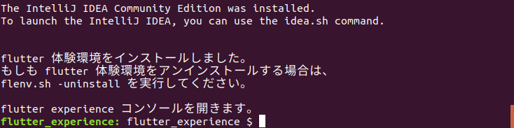

## flutter for web 環境を作る
独習できるよう、下記の flutter for web 環境構築手順を紹介します。  

- 公式資料での環境構築手順 (経験者向け)
- 独自自動スクリプトを使った環境構築手順 (初学者向け)

<br/>

### 公式資料での環境構築手順
*何らかの環境構築の経験があるかた向けの手順です。*  
*英文公式資料を理解して独力作業できることが求められます。*

1. **flutter環境の構築** [公式インストール資料](https://flutter.dev/docs/get-started/install)  
[Windows install](https://flutter.dev/docs/get-started/install/windows)  
[macOS install](https://flutter.dev/docs/get-started/install/macos)  
[Linux install](https://flutter.dev/docs/get-started/install/linux)  

1. **IntelliJ IDEA Community Edition インストール**  
[Set up an editor](https://flutter.dev/docs/get-started/editor?tab=androidstudio)

1. **dhttpd ツールのインストール** (オプション)  
[dhttpd パッケージ](https://pub.dev/packages/dhttpd) [(github)](https://github.com/kevmoo/dhttpd)

1. **flutter for web 周りの環境設定**  
[Building a web application with Flutter](https://flutter.dev/docs/get-started/web)

#### 公式資料での環境構築手順の概要
- **git コマンドを利用できることが、必須要件に含まれていることに注意！**
- **[Chrome ブラウザ](https://www.google.co.jp/chrome/) のインストールも、必須要件に含まれていることに注意！**

1. 手順 1 に従って、flutter sdk をインストール、  
シェル起動ファイルに設定を追加、flutter sdk インストールを確認。
2. 手順 2 に従って、IntelliJ + Dart & Flutter プラグインをインストール。
3. 手順 3 のパッケージ資料に従って、dhttpd ツールをインストール。
4. 手順 4 に従って、flutter for web 環境設定＋Webアプリのビルドと起動を行う。

- 備考：dhttpd で、webアプリをホストする。(スマートフォンで webアプリの動作を確認)
- 備考：flutter 安定版環境に切り替える。(flutter config 環境設定のクリア含む)

<br/>

```bash
# 1. git コマンドを使った、flutter sdk をインストールする例
$ git clone https://github.com/flutter/flutter.git -b stable
```

```file
# 1. シェル起動ファイル(.bashrc など)に追加する、flutter環境変数設定例
export FLUTTER_ROOT=(SDK配置パス)/flutter
export DART_SDK_PATH=$FLUTTER_ROOT/bin/cache/dart-sdk
export PUB_CACHE=$FLUTTER_ROOT/.pub-cache
export PATH=(既存パス設定):$FLUTTER_ROOT/bin:$DART_SDK_PATH/bin
```

```bash
# 1. flutter コマンドを使った、flutter sdk インストール確認実行例
#   (flutter 環境の診断結果が表示されます)
$ flutter doctor
```

```bash
# 2. IntelliJ IDEA Community Edition と
#    Dart + Flutter Plugin インストールの概要は、
#    公式資料を参照してください。
```

```bash
# 3. dhttpd ツールのインストールする、git コマンド
$ git clone https://github.com/kevmoo/dhttpd.git
```

```bash
# 4. flutter for web 環境切替コマンド
$ flutter channel beta (2021/12/30現在、flutter for web は stable で利用可能となったので、この行の指定は不要です。)
$ flutter upgrade
$ flutter config --enable-web

# 4. プロジェクトで使えるパッケージを最新化するコマンド
$ flutter pub get

# 4. プロジェクトのビルド済のアプリをクリアするコマンド
$ flutter clean

# 4. プロジェクトを web アプリとしてビルドするコマンド
$ flutter build web

# 4. web アプリを Chrome ブラウザで実行するコマンド
$ flutter run -d chrome
```

```bash
# 備考：dhttpd を使って、webアプリをホストする。
# 　　　PC と同じ WiFi アクセスポイントを利用しているスマートフォンのブラウザで、
# 　　　flutter for webアプリの動作を確認することができるようになります。

# プロジェクトのディレクトリに移動
$ cd (プロジェクト・ディレクトリ)

# web アプリをビルドする
$ flutter build web

# web アプリを dhttpd でホストする。
$ dart (dhhtpdインストールパス)/bin/dhttpd.dart --host (PCのIPアドレス) --port 8080 --path build/web

# スマートフォンのブラウザで、以下の URL を開きます。
# http://(PCのIPアドレス):8080/index.html

# ホストを止める場合は、CTRL-C で dhttpd を止めてください。
```

```bash
# 備考：flutter 安定版環境に切り替える。
# 　　　(flutter config 環境設定のクリア含む)

$ flutter channel stable
$ flutter upgrade
$ flutter config --clear-features
```

<br/>
<br/>

### 独自自動スクリプトを使った環境構築手順
MacOS または Linux 環境かつ、git コマンドが使えることが前提ですが、  
独自自動スクリプトで flutter for web 体験環境を構築することも可能です。
- flutter for web 体験環境構築スクリプト ⇒ [**flenv.sh**](https://github.com/cch-robo/DevFest-Kyoto-2020/blob/master/scripts/flenv.sh) [(ダウンロード)](./scripts/flenv.sh) 
- **git コマンドを利用できることが、必須要件に含まれていることに注意！**
- **[Chrome ブラウザ](https://www.google.co.jp/chrome/) のインストールも、必須要件に含まれていることに注意！**

1. `flenv.sh` スクリプトファイルを[ダウンロード](./scripts/flenv.sh)。
2. `flenv.sh` スクリプトファイルを sdk をインストールするディレクトリに配置。
3. ターミナルを開き、後述のインストール手順を実行。
4. インストール完了後、`flutter_experience コンソール`が開きます。
5. `flutter_experience コンソール`でできることの紹介。
6. dhttpd で、webアプリをホストする。(スマートフォンで webアプリの動作を確認)
7. 新しいターミナルで`flutter_experience コンソール`を復元する。
8. flutter 体験環境をアンインストールする。(`flutter_experience`ディレクトリ全削除)

- 備考：flutter 体験環境を安定版に切り替える。(flutter config 環境設定のクリア含む)

<br/>

```bash
# 3. インストール手順を実行

# カレントディレクトリを flenv.sh 配置先に移動
cd スクリプト配置先ディレクトリ

# flenv.sh スクリプトに実行権限を付与
chmod +x flenv.sh

# flutter 体験環境構築を自動実行
./flenv.sh -install

# ネットワーク速度に依存しますが、およそ20分ほどで、
# flenv.sh 配置先に `flutter_experience` ディレクトリが新規作成され、
# flutter sdk および、flutter for web 設定の実行と dhttpd ツールをインストール、
# IntelliJ IDEA Community Edition、および Dart+Flutter プラグインのインストールが完了します。
# 補足：flenv.sh ファイルは、インストール完了後に `flutter_experience` ディレクトリに移動しています。
# 補足：flutter 体験環境をアンインストールする場合は、flenv.sh -uninstall を実行してください。
```



```bash
# 5. `flutter_experience コンソール`でできることの紹介
#    当該コンソールでは、`flutter` コマンドが使えます。
#    (コマンドは、プロジェクト・ディレクトリで、実行してください)

# プロジェクト・ディレクトリに移動
$ cd (プロジェクト・ディレクトリ)

# プロジェクトで使えるパッケージを最新化するコマンド
$ flutter pub get

# プロジェクトのビルド済のアプリをクリアする
$ flutter clean

# プロジェクトを web アプリとしてビルドするコマンド
$ flutter build web

# web アプリを Chrome ブラウザで実行するコマンド
$ flutter run -d chrome


# `flutter_experience コンソール`では、
# `flutter` や `dart` コマンドの他に、IntelliJ IDEA の起動や `flenv.sh` スクリプトも使えます。

# IntteliJ IDEA Community Edition の起動 (MacOS版)
$ idea

# IntteliJ IDEA Community Edition の起動 (Linux版)
$ idea.sh

# `flenv.sh`スクリプトで使えるオプション一覧表示 (ヘルプ・オプション)
$ flenv.sh -help 
```

```bash
# 6. dhttpd を使って、webアプリをホストする。
#    PC と同じ WiFi アクセスポイントを利用しているスマートフォンのブラウザで、
#    flutter for webアプリの動作を確認することができるようになります。

# プロジェクトのディレクトリに移動
$ cd (プロジェクト・ディレクトリ)

# web アプリをビルドする
$ flutter build web

# web アプリを dhttpd でホストする。(PCのIPアドレスを自動設定)
$ flenv.sh -server

# web アプリを dhttpd でホストする。(PCのIPアドレスを手動設定)
$ flenv.sh -server (PCのIPアドレス)

# スマートフォンのブラウザで、以下の URL を開きます。
# http://(PCのIPアドレス):8080/index.html

# ホストを止める場合は、CTRL-C で dhttpd を止めてください。
```

```bash
# 7. 新しいターミナルで`flutter_experience コンソール`を復元する
#    新しいターミナルを開き、以下の手順を行ってください。

# `flutter_experience`ディレクトリに移動
$ cd (flutter_experience ディレクトリ)

# `flutter_experience コンソール`を復元
$ ./flenv.sh -resume
```

```bash
# 8. flutter 体験環境をアンインストールする。
#    `flutter_experience`ディレクトリを全削除します。
#    残したいファイルやディレクトリがあれば、別の場所に移動させてから、
#    `flutter_experience コンソール`で、以下の手順を行ってください。

# `flutter_experience`ディレクトリの 1つ上(親ディレクトリ)に移動
$ cd (flutter_experience 親ディレクトリ)

# flutter 体験環境をアンインストール
flenv.sh -uninstall
```

```bash
# 備考：flutter 体験環境を安定版に切り替える。
# 　　　(環境設定のクリア)

$ flutter channel stable
$ flutter upgrade
$ flutter config --clear-features
```
